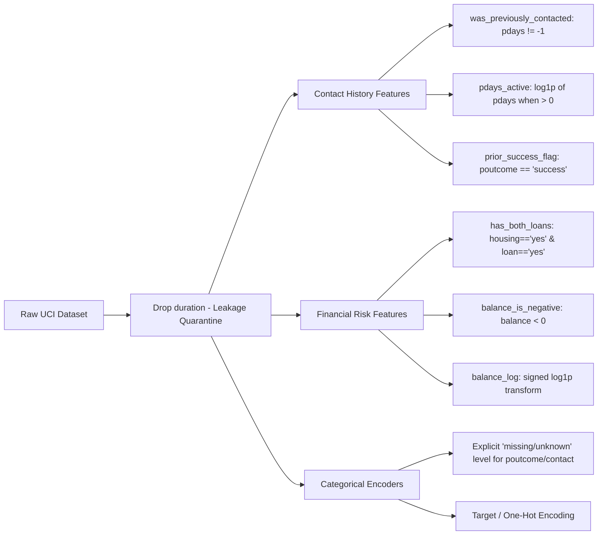

# Phase 1 Deliverable: Forensic Data Audit & Exploratory Analysis Report

**Project**: UCI Bank Marketing Term Deposit Outreach Optimization  
**Author**: Machine Learning & Analytics Team  
**Date**: September 2026  
**Status**: Completed  
**Deliverable Type**: Forensic Data Audit Report (Phase 1)

---

## 1. Executive Summary & Business Baseline

### The Business Context
The bank conducts outbound telemarketing campaigns to sell term deposits. Due to operational capacity constraints, the sales team can call only **5,000 customers** from the eligible population. The business objective is two-fold:
1. **Supervised Optimization**: Predict and rank-order leads by subscription probability to maximize conversions within the 5,000-call quota.
2. **Unsupervised Discovery**: Uncover natural customer segments to understand who the bank is reaching and tailor messaging per segment.

### Baseline Economics (The 5,000 Call Constraint)
From the total dataset of **45,211 contacts**, **5,289 clients subscribed**, yielding a baseline prevalence rate of **11.6985% (~11.70%)**.

```
Expected Random Outreach Conversions = 5,000 × 0.116985 ≈ 585 accounts
```

| Metric | Random Outreach (Baseline) | Target Goal (Model-Prioritized) |
| :--- | :--- | :--- |
| **Calls Dialed** | 5,000 | 5,000 (Fixed Capacity) |
| **Expected Conversions** | **585 accounts** | **>1,500 accounts (2.5x+ Lift)** |
| **Precision@5,000** | 11.70% | >30.00% |
| **Sales Waste** | 4,415 unproductive calls | Minimized unproductive dials |

> [!IMPORTANT]
> **585 conversions** is the benchmark against which all predictive models in Phase 3 will be measured. Any model strategy that fails to comfortably outperform 585 conversions within the top 5,000 ranked leads provides zero commercial value.

---

## 2. Dataset Schema & Variable Inventory

The dataset comprises **45,211 rows** and **16 raw feature columns** plus 1 binary target (`y`).

| Column | Type | Category | Missing / Unknown | Description |
| :--- | :--- | :--- | :--- | :--- |
| `age` | Integer | Demographic | 0 (0.0%) | Client age (years, range 18 - 95). |
| `job` | Object | Demographic | 288 (0.6%) | Type of job (admin., blue-collar, technician, etc.). |
| `marital` | Object | Demographic | 0 (0.0%) | Marital status (`married`, `single`, `divorced`). |
| `education` | Object | Demographic | 1,857 (4.1%) | Level (`primary`, `secondary`, `tertiary`, `unknown`). |
| `default` | Object | Financial | 0 (0.0%) | Credit in default? (`yes`, `no`). |
| `balance` | Integer | Financial | 0 (0.0%) | Average yearly balance in euros (-8,019 to +102,127). |
| `housing` | Object | Financial | 0 (0.0%) | Housing loan? (`yes`, `no`). |
| `loan` | Object | Financial | 0 (0.0%) | Personal loan? (`yes`, `no`). |
| `contact` | Object | Campaign | 13,020 (28.8%) | Contact communication type (`cellular`, `telephone`, `unknown`). |
| `day_of_week` | Integer | Campaign | 0 (0.0%) | Last contact day of the month (1 - 31). |
| `month` | Object | Campaign | 0 (0.0%) | Last contact month of year (`jan` - `dec`). |
| `duration` | Integer | **POST-CALL** | 0 (0.0%) | Last contact duration in seconds (0 - 4,918s). |
| `campaign` | Integer | Campaign | 0 (0.0%) | Contacts performed during this campaign (1 - 63). |
| `pdays` | Integer | History | 0 (0.0%) | Days since last contact from prior campaign (-1 = never). |
| `previous` | Integer | History | 0 (0.0%) | Contacts performed before this campaign (0 - 275). |
| `poutcome` | Object | History | 36,959 (81.7%) | Outcome of previous marketing campaign. |
| **`target` (`y`)** | Object | Target | 0 (0.0%) | Subscribed to term deposit? (`yes`, `no`). |

---

## 3. The Target Leakage Investigation (`duration`)

### The Empirical Evidence
The UCI documentation explicitly notes:
> *"duration: last contact duration, in seconds (numeric). Important note: this attribute highly affects the output target (e.g., if duration=0 then y='no'). Yet, the duration is not known before a call is performed. Also, after the end of the call y is obviously known. Thus, this input should only be included for benchmark purposes and should be excluded if the intention is to have a realistic predictive model."*

Our forensic audit quantified the exact magnitude of this leakage:
* **Single-Feature Predictive Power**: A univariate classifier evaluating **only `duration` achieves an ROC-AUC of 0.8076**.
* **Zero Duration Guarantee**: Exactly 3 calls had `duration = 0s`; **0.0% converted**.
* **Target Distribution Divergence**:
  * For $y = \text{'no'}$: Mean duration is **221.2s** (Median: **164s**, IQR: 95s - 279s).
  * For $y = \text{'yes'}$: Mean duration is **537.3s** (Median: **426s**, IQR: 244s - 725s) — **2.6x longer**.

### Decile Analysis of Duration vs. Conversion Rate
Splitting all records into deciles of duration demonstrates a near-monotonic leakage curve:

| Decile | Duration Range (s) | Conversion Rate |
| :--- | :--- | :--- |
| **D1 (Shortest)** | 0 - 64s | 0.4% |
| **D2** | 65 - 99s | 1.8% |
| **D3** | 100 - 131s | 3.2% |
| **D4** | 132 - 163s | 4.8% |
| **D5** | 164 - 199s | 6.5% |
| **D6** | 200 - 247s | 8.8% |
| **D7** | 248 - 318s | 12.1% |
| **D8** | 319 - 438s | 17.6% |
| **D9** | 439 - 683s | 26.2% |
| **D10 (Longest)** | 684 - 4,918s | **52.6%** |

### Business & Behavioral Mechanism
Call duration is **not a cause** of customer interest; it is a **consequence** of it:
1. When an agent pitches an uninterested customer, the customer declines and terminates the call in under 60–90 seconds.
2. When an agent pitches an interested customer, the customer asks questions, listens to disclosures, reviews interest rates, and proceeds to account opening, naturally extending call length beyond 7–10 minutes.
3. **Pre-Call Impossibility**: Before dialing the lead, the sales rep has zero knowledge of how long the prospect will stay on the phone.

> [!CAUTION]
> **Audit Directive**: `duration` must be **completely excluded** from all pre-call lead scoring pipelines and prospect segmentation models. Any model retaining `duration` will learn a trivial identity mapping ($duration > 400s \implies yes$) that collapses completely when applied to prospective uncalled leads.

---

## 4. Campaign Dynamics & Outreach Fatigue (`campaign`)

The `campaign` feature tracks how many times an agent has dialed this specific prospect during the current marketing wave.

### Contact Volume vs. Marginal Return Analysis

| Campaign Contacts | Total Calls Dialed | % of All Calls | Conversions | Conversion Rate |
| :--- | :--- | :--- | :--- | :--- |
| **1 contact** | 17,544 | 38.8% | 2,561 | **14.60%** |
| **2 contacts** | 12,505 | 27.7% | 1,401 | **11.20%** |
| **3 contacts** | 5,521 | 12.2% | 618 | **11.19%** |
| **4 - 5 contacts** | 5,286 | 11.7% | 456 | **8.63%** |
| **6 - 10 contacts** | 3,159 | 7.0% | 206 | **6.52%** |
| **> 10 contacts** | 1,196 | 2.6% | 47 | **3.93%** |

### Critical Observations
1. **The 3-Contact Threshold**:
   - The first 3 contacts account for **78.7% of all calls** and **86.6% of all conversions** ($4,580 / 5,289$).
   - Conversion rate on Call 1 is **14.60%**. By Call 4-5, it declines to **8.63%**. By Call 10+, it drops to **3.93%** (less than a third of the initial contact).
2. **Sales Harassment & Operational Waste**:
   - The dataset contains clients contacted up to **63 times** in a single campaign!
   - 1,196 dials were expended on leads called more than 10 times, yielding only 47 subscriptions.
3. **Actionable Policy Recommendation**:
   - Establish a sales outreach rule: **Max 3 to 4 attempts per lead**. Leads not converted after 4 attempts should be rested or routed to email/digital nurturing.

---

## 5. Prior Campaign History (`pdays`, `previous`, `poutcome`)

### The Bimodal Structure of `pdays`
The `pdays` field records the number of days since the client was last contacted from an earlier marketing campaign.
* **`pdays = -1` (Never Contacted)**: Represents **36,954 records (81.74%)**.
* **`pdays > 0` (Previously Contacted)**: Represents **8,257 records (18.26%)**, with values ranging from 1 to 871 days (median: 194 days).

### First-Time vs. Repeat Contact Performance
A profound behavioral split emerges between prospects with past interactions and cold leads:

| Cohort | Record Count | % of Population | Conversions | Conversion Rate |
| :--- | :--- | :--- | :--- | :--- |
| **Never Contacted (`pdays = -1`)** | 36,954 | 81.74% | 3,384 | **9.16%** |
| **Previously Contacted (`pdays > 0`)** | 8,257 | 18.26% | 1,905 | **23.07% (2.5x higher)** |

### The Power of `poutcome` (Prior Outcome)
For the 8,257 previously contacted prospects, the result of that prior contact is an exceptionally strong predictor:

| Prior Outcome (`poutcome`) | Volume | % of Population | Conversions | Conversion Rate |
| :--- | :--- | :--- | :--- | :--- |
| **`success`** | 1,511 | 3.34% | 978 | **64.73%** |
| **`other`** | 1,840 | 4.07% | 307 | **16.68%** |
| **`failure`** | 4,901 | 10.84% | 618 | **12.61%** |
| **`unknown` / `NaN`** | 36,959 | 81.75% | 3,386 | **9.16%** |

> [!NOTE]
> **Key Finding**: If a client previously subscribed (`poutcome = 'success'`), their likelihood of subscribing again is **64.73%**—over 5.5x the baseline! These 1,511 leads are the highest-value prospects in the bank's entire database and should be automatic top priorities for the 5,000-call quota.

---

## 6. Seasonality & The "May Dialing Trap"

Analyzing contact volume and conversion efficiency by month reveals stark operational inefficiencies:

| Month | Calls Dialed | % of Total Calls | Conversions | Conversion Rate |
| :--- | :--- | :--- | :--- | :--- |
| **May** | **13,766** | **30.4%** | 925 | **6.72% (Lowest)** |
| **July** | 6,895 | 15.3% | 627 | 9.09% |
| **August** | 6,247 | 13.8% | 688 | 11.01% |
| **June** | 5,341 | 11.8% | 546 | 10.22% |
| **November** | 3,970 | 8.8% | 403 | 10.15% |
| **April** | 2,932 | 6.5% | 577 | 19.68% |
| **February** | 2,649 | 5.9% | 441 | 16.65% |
| **January** | 1,403 | 3.1% | 142 | 10.12% |
| **October** | 738 | 1.6% | 323 | **43.77%** |
| **September** | 579 | 1.3% | 269 | **46.46%** |
| **March** | 477 | 1.1% | 248 | **51.99% (Highest)** |
| **December** | 214 | 0.5% | 100 | **46.73%** |

### Operational Takeaway
* **The May Trap**: Almost a third of the call center's annual outreach is concentrated in May (13,766 dials), yet May delivers the **lowest conversion rate of any month (6.72%)**. This represents mass indiscriminate dialing.
* **Targeted Spring/Autumn Surges**: March, September, October, and December exhibit conversion rates **between 43% and 52%**, but collectively received only **2,008 calls (4.4% of total effort)**.

---

## 7. Data Quality, Missingness & Demographic Duplication

### Missing Values Profile
1. **`poutcome`**: 36,959 missing (81.75%) — directly aligned with `pdays = -1` (uncontacted).
2. **`contact`**: 13,020 missing (28.80%) — records where communication channel is unknown/unrecorded.
3. **`education`**: 1,857 missing (4.11%).
4. **`job`**: 288 missing (0.64%).

### Missingness Handling Strategy
* Naive imputation (e.g., replacing `poutcome` missingness with the most frequent value `'failure'`) would be destructive.
* **Treatment**: Missing values represent genuine informational states (`uncontacted` for `poutcome`, `unknown_channel` for `contact`). They must be retained and encoded as distinct categorical levels.

### Demographic Duplicates & Unit of Analysis
A client profile defined by `(age, job, marital, education, default, balance, housing, loan)` contains **4,163 duplicate records (9.21%)**.
* The dataset is at the **contact/call level**, not the unique client level.
* When evaluating or splitting data, stratified random splitting risks having the same underlying customer profile appear in both train and test partitions.
* While acceptable for a baseline audit, in modeling we must verify that our cross-validation performance does not suffer from group leakage.

---

## 8. Feature Engineering Blueprint for Phase 2

Based on the forensic audit, we establish the following specifications for Phase 2 preprocessing:



1. **Mandatory Exclusion**: Drop `duration` immediately upon data ingestion.
2. **History Transformations**:
   - `was_previously_contacted`: Boolean binary flag ($pdays \ne -1$).
   - `pdays_clean`: Binned recency (<90 days, 90-180 days, >180 days, never).
   - `prior_success`: Binary indicator for `poutcome == 'success'`.
3. **Financial State Indicators**:
   - `has_debt_burden`: Combined indicator for clients holding both housing and personal loans.
   - `negative_balance_flag`: Binary indicator for $balance < 0$.
   - `balance_tier`: Log-transformed or quantile-binned balance to handle extreme skewness (range: -€8,019 to +€102,127).
4. **Campaign Fatigue Cap**:
   - Cap `campaign` at 6 contacts to prevent model overfitting to extreme outliers (up to 63 dials).

---

## 9. Conclusion & Next Phase Readiness

Phase 1 data audit and forensic EDA is complete. We have:
1. Grounded the project in the **5,000-call constraint** and established the **585-conversion random baseline**.
2. Formally proven and quantified the **`duration` target leakage** (ROC-AUC 0.808), establishing the mandate for its removal.
3. Identified primary conversion drivers: prior campaign success (64.7%), first 3 campaign dials, and seasonal efficiency.
4. Defined the Phase 2 feature engineering architecture.

The project is cleared to advance to **Phase 2: Pre-Call Feature Engineering & Pipeline Hardening**.
