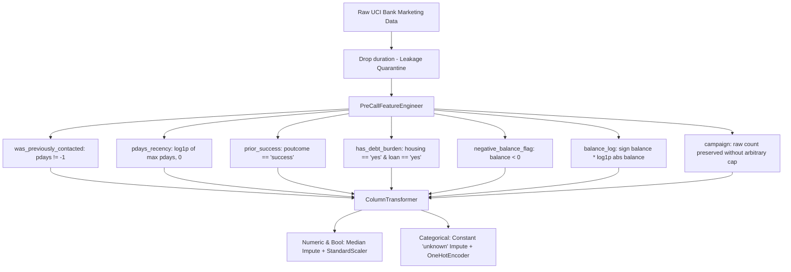

# Phase 1 Deliverable: Forensic Data Audit & Exploratory Analysis Report

**Project**: UCI Bank Marketing Term Deposit Outreach Optimization  
**Author**: Machine Learning & Analytics Team  
**Date**: September 2026 (Updated Post-Reconciliation)  
**Status**: Completed & Verified  
**Deliverable Type**: Forensic Data Audit Report (Phase 1)

---

## 1. Executive Summary & Business Baseline

### The Business Problem & Decision Context
The bank conducts outbound telemarketing campaigns to sell term deposits. Due to operational capacity constraints, the sales team can call only **5,000 customers** from the eligible prospect population. The business goals are:
1. **Supervised Lead Prioritization**: Rank-order prospects by conversion probability to maximize subscriptions within the 5,000-call quota.
2. **Unsupervised Prospect Segmentation**: Uncover natural customer segments to understand who the campaign reaches and tailor messaging per segment.

### Baseline Economics & The Two-Tier Benchmark
From the total dataset of **45,211 contact records**, **5,289 clients subscribed**, yielding a baseline prevalence rate of **11.6985% (~11.70%)**.

```
Expected Random Outreach Conversions = 5,000 × 0.116985 ≈ 585 accounts
```

Crucially, **beating random selection is necessary but insufficient**. A competent sales operation uses intuitive pre-call business heuristics (e.g. prioritizing prior campaign winners and debt-free liquid clients). Therefore, later ML models must beat **both** benchmarks:

| Outreach Strategy | Method / Logic | Expected Conversions @ 5,000 Calls | Precision @ 5,000 | Lift @ 5,000 |
| :--- | :--- | :--- | :--- | :--- |
| **Random Baseline** | Uniform random selection from eligible pool | **~585 accounts** | **11.70%** | **1.00x** |
| **Business-Rule Baseline** | Heuristic: Prior success (`poutcome == 'success'`), then prior contact (`pdays != -1`) without loans, tie-broken by `balance` | **~1,664 accounts** | **33.28%** | **2.84x** |
| **Target ML Models (Phase 3)** | Supervised rank-ordering optimizing PR-AUC & Precision@k | **Target: >2,000 accounts** | **Target: >40.00%** | **Target: >3.50x** |

> [!IMPORTANT]
> A machine learning model that produces 1,200 conversions beats random outreach (585), but delivers negative business value compared to a simple, transparent business heuristic (1,664). All supervised models in Phase 3 will be evaluated against both hurdle rates.

---

## 2. Dataset Schema & Variable Inventory

The dataset comprises **45,211 contact records** with **16 raw feature attributes** and 1 binary target (`y`).

| Column | Type | Category | Missing / Unknown | Description |
| :--- | :--- | :--- | :--- | :--- |
| `age` | Integer | Demographic | 0 (0.0%) | Client age (years, range 18 - 95). |
| `job` | Object | Demographic | 288 (0.6%) | Type of job (admin., blue-collar, technician, etc.). |
| `marital` | Object | Demographic | 0 (0.0%) | Marital status (`married`, `single`, `divorced`). |
| `education` | Object | Demographic | 1,857 (4.1%) | Level (`primary`, `secondary`, `tertiary`, `unknown`). |
| `default` | Object | Financial | 0 (0.0%) | Credit in default? (`yes`, `no`). |
| `balance` | Integer | Financial | 0 (0.0%) | Average yearly balance in euros (-8,019 to +102,127). |
| `housing` | Object | Financial | 0 (0.0%) | Housing loan? (`yes`, `no`). |
| `loan` | Object | Financial | 0 (0.0%) | Personal loan? (`yes`, `no`). |
| `contact` | Object | Campaign | 13,020 (28.8%) | Contact communication type (`cellular`, `telephone`, `unknown`). |
| `day_of_week` | Integer | Campaign | 0 (0.0%) | Last contact day of the month (1 - 31). |
| `month` | Object | Campaign | 0 (0.0%) | Last contact month of year (`jan` - `dec`). |
| `duration` | Integer | **POST-CALL** | 0 (0.0%) | Last contact duration in seconds (0 - 4,918s). |
| `campaign` | Integer | Campaign | 0 (0.0%) | Number of contacts performed during this campaign (1 - 63). |
| `pdays` | Integer | History | 0 (0.0%) | Days since last contact from prior campaign (-1 = never). |
| `previous` | Integer | History | 0 (0.0%) | Contacts performed before this campaign (0 - 275). |
| `poutcome` | Object | History | 36,959 (81.7%) | Outcome of previous marketing campaign. |
| **`target` (`y`)** | Object | Target | 0 (0.0%) | Subscribed to term deposit? (`yes`, `no`). |

---

## 3. The Target Leakage Investigation (`duration`)

### Empirical Evidence of Leakage
The UCI dataset documentation explicitly notes that `duration` is only known after a call has been concluded. Our forensic audit quantified the strength of this post-call leakage:
* **Univariate Predictive Power**: A model using **only `duration` achieves an ROC-AUC of 0.8076**.
* **Zero Duration Reality**: Exactly 3 calls had `duration = 0s`; **0.0% converted**.
* **Target Distribution Shift**:
  * For $y = \text{'no'}$: Mean duration is **221.2s** (Median: **164s**, IQR: 95s - 279s).
  * For $y = \text{'yes'}$: Mean duration is **537.3s** (Median: **426s**, IQR: 244s - 725s) — **2.6x longer**.

### Decile Analysis of Duration vs. Conversion Rate
Partitioning records into deciles of duration reveals a steep post-hoc association:

| Decile | Duration Range (s) | Conversion Rate |
| :--- | :--- | :--- |
| **D1 (Shortest)** | 0 - 64s | 0.4% |
| **D2** | 65 - 99s | 1.8% |
| **D3** | 100 - 131s | 3.2% |
| **D4** | 132 - 163s | 4.8% |
| **D5** | 164 - 199s | 6.5% |
| **D6** | 200 - 247s | 8.8% |
| **D7** | 248 - 318s | 12.1% |
| **D8** | 319 - 438s | 17.6% |
| **D9** | 439 - 683s | 26.2% |
| **D10 (Longest)** | 684 - 4,918s | **52.6%** |

### Mechanism: Strong Post-Call Leakage, Not Deterministic Identity
Call duration is a **consequence** of the conversation unfolding, not a pre-call causal attribute. While a long conversation is strongly correlated with conversion (because explaining terms and closing takes time, whereas uninterested prospects decline quickly), it is **not a deterministic identity mapping**:
- Over 47% of calls in Decile 10 (684s+ to over an hour) still ended in `'no'`.
- Several dozen successful conversions occurred in under 120 seconds.
- Most critically: **at the moment a lead is selected from the CRM, duration is completely unknown**.

> [!CAUTION]
> **Enforcement in Code**: `duration` must be strictly removed from all feature selection, preprocessing pipelines, and clustering inputs. This is enforced programmatically via `PreCallFeatureEngineer` and `drop_duration()` in `src/features/build_features.py`.

---

## 4. Campaign Outreach Dynamics (`campaign`)

The `campaign` attribute records the number of contacts performed during the current campaign for this record.

### Contact Record Distribution & Conversion Rate

| Campaign Contacts | Contact Records | % of Observations | Conversions | Conversion Rate |
| :--- | :--- | :--- | :--- | :--- |
| **1 contact** | 17,544 | 38.8% | 2,561 | **14.60%** |
| **2 contacts** | 12,505 | 27.7% | 1,401 | **11.20%** |
| **3 contacts** | 5,521 | 12.2% | 618 | **11.19%** |
| **4 - 5 contacts** | 5,286 | 11.7% | 456 | **8.63%** |
| **6 - 10 contacts** | 3,159 | 7.0% | 206 | **6.52%** |
| **> 10 contacts** | 1,196 | 2.6% | 47 | **3.93%** |

### Observational Interpretation (Avoiding Causal Leaps)
* **Observational Association**: The empirical conversion rate declines steadily across higher contact tiers (from 14.60% at 1 contact down to 3.93% at >10 contacts).
* **Selection Effect Hypothesis**: This pattern does **not** prove that repeatedly calling a customer causes them to decline. Rather, it likely reflects a strong negative selection effect: prospects who are responsive or interested tend to convert on initial contacts (1–3), while recalcitrant, unreachable, or hesitant prospects accumulate repeated outreach attempts precisely because they have not subscribed.
* **Pipeline Action**: We do **not** arbitrarily cap or truncate `campaign` in the feature pipeline. Retaining the true raw count preserves genuine outreach history while allowing tree-based or regularized models to learn non-linear relationships without artificial data distortion.

---

## 5. Prior Campaign History (`pdays`, `previous`, `poutcome`)

### The Structure of `pdays`
* **`pdays = -1` (Never Contacted Previously)**: Represents **36,954 records (81.74%)**.
* **`pdays > 0` (Previously Contacted)**: Represents **8,257 records (18.26%)**, with values from 1 to 871 days.

### First-Time vs. Repeat Contact Records

| Contact History | Record Count | % of Population | Conversions | Conversion Rate |
| :--- | :--- | :--- | :--- | :--- |
| **Never Contacted (`pdays = -1`)** | 36,954 | 81.74% | 3,384 | **9.16%** |
| **Previously Contacted (`pdays > 0`)** | 8,257 | 18.26% | 1,905 | **23.07% (2.5x higher)** |

### Prior Outcome (`poutcome`) Breakdown & The 5 Alignment Exceptions

| Prior Outcome (`poutcome`) | Volume | % of Population | Conversions | Conversion Rate |
| :--- | :--- | :--- | :--- | :--- |
| **`success`** | 1,511 | 3.34% | 978 | **64.73%** |
| **`other`** | 1,840 | 4.07% | 307 | **16.68%** |
| **`failure`** | 4,901 | 10.84% | 618 | **12.61%** |
| **`unknown` / `NaN`** | 36,959 | 81.75% | 3,386 | **9.16%** |

#### Investigation of the Near-Perfect Alignment Exceptions:
While `pdays == -1` (36,954 records) and `poutcome.isna()` (36,959 records) appear identical at first glance, there is a small discrepancy of **exactly 5 records**:
* For all 36,954 records where `pdays == -1`, `poutcome` is missing/NaN (100% agreement).
* However, **5 records** have `pdays > 0` and `previous >= 1`, yet `poutcome` is `NaN`:
  * Record 40658: `pdays = 98`, `previous = 1`
  * Record 41821: `pdays = 168`, `previous = 5`
  * Record 42042: `pdays = 188`, `previous = 2`
  * Record 43978: `pdays = 416`, `previous = 2`
  * Record 45021: `pdays = 528`, `previous = 7`
* **Interpretation**: These 5 observations represent repeat contacts where the prior campaign result was unrecorded or missing in the source CRM. Preserving `unknown` as an explicit categorical state ensures these records are handled robustly without corrupting feature consistency.

---

## 6. Campaign Timing & Seasonality (`month`)

Analyzing contact records and observed conversion rates across calendar months:

| Month | Observations (Records) | % of Total Records | Conversions | Observed Conversion Rate |
| :--- | :--- | :--- | :--- | :--- |
| **May** | **13,766** | **30.4%** | 925 | **6.72% (Lowest)** |
| **July** | 6,895 | 15.3% | 627 | 9.09% |
| **August** | 6,247 | 13.8% | 688 | 11.01% |
| **June** | 5,341 | 11.8% | 546 | 10.22% |
| **November** | 3,970 | 8.8% | 403 | 10.15% |
| **April** | 2,932 | 6.5% | 577 | 19.68% |
| **February** | 2,649 | 5.9% | 441 | 16.65% |
| **January** | 1,403 | 3.1% | 142 | 10.12% |
| **October** | 738 | 1.6% | 323 | **43.77%** |
| **September** | 579 | 1.3% | 269 | **46.46%** |
| **March** | 477 | 1.1% | 248 | **51.99% (Highest)** |
| **December** | 214 | 0.5% | 100 | **46.73%** |

### Observational Interpretation
* **Correlation, Not Causation**: May records the lowest conversion rate (6.72%) alongside the highest observation volume (13,766 records), while March, September, October, and December show conversion rates above 43%.
* **Confounding Factors**: We do **not** claim that shifting calls from May to October would causally increase conversions. The low conversion rate in May likely reflects broad, untargeted outreach waves, whereas the high rates in March/September/October/December may reflect highly pre-screened cohorts, special promotions, differing macroeconomic conditions (e.g. interest rate cycles), or tax/fiscal year-end timing.

---

## 7. Data Quality, Missingness & Unit of Analysis

### Missingness Handling: Preserving Informative States
* Missing counts: `poutcome` (36,959), `contact` (13,020), `education` (1,857), `job` (288).
* In this dataset, missingness carries domain meaning (`poutcome` missingness reflects uncontacted clients; `contact` missingness reflects unrecorded channels).
* **Pipeline Rule**: Categorical imputation must use a constant `'unknown'` strategy. Imputing `poutcome` via `most_frequent` would falsely label over 36,000 uncontacted records as `'failure'`, corrupting the training signal.

### Unit of Analysis & Repeated Demographic/Financial Profiles
Evaluating subsets defined by `(age, job, marital, education, default, balance, housing, loan)` reveals **4,163 repeated profiles (9.21%)**.
* **Distinction**: In the absence of unique client identifiers (such as a customer ID, SSN, or account number), we cannot prove that two records with identical demographics and balances are the same individual called across multiple campaigns. They may simply be distinct clients with identical demographic and financial features.
* **Validation Decision & Limitations**:
  * We retain a **stratified random split** as the baseline validation method.
  * We explicitly document the limitation: without client IDs and calendar years, complete independence of observations cannot be mathematically guaranteed. However, we avoid overstating claims of proven group leakage based solely on demographic overlaps.

---

## 8. Phase 2 Feature Engineering Blueprint

The pre-call feature pipeline is formally codified in `src/features/build_features.py`:



1. **Leakage Elimination**: Programmatic removal of `duration`.
2. **Prior Contact Transformations**: `was_previously_contacted` binary flag and `pdays_recency` ($\log1p(\max(pdays, 0))$) avoiding the $-1$ sentinel distortion.
3. **Financial Burden & Balance**: `has_debt_burden`, `negative_balance_flag`, and signed $\log1p$ balance representation.
4. **Outreach Frequency**: Raw `campaign` contacts preserved.
5. **Categorical Imputation**: Constant `'unknown'` strategy inside sklearn pipeline.

---

## 9. Next Phase Readiness & Benchmarks

Phase 1 data audit reconciliation and Phase 2 pre-call pipeline implementation are complete:
- Random Outreach Benchmark: **585 conversions @ 5,000 calls (11.70% precision, 1.00x lift)**
- Business-Rule Heuristic Benchmark: **1,664 conversions @ 5,000 calls (33.28% precision, 2.84x lift)**
- All code has been verified and tested against the updated ranking evaluation framework.
