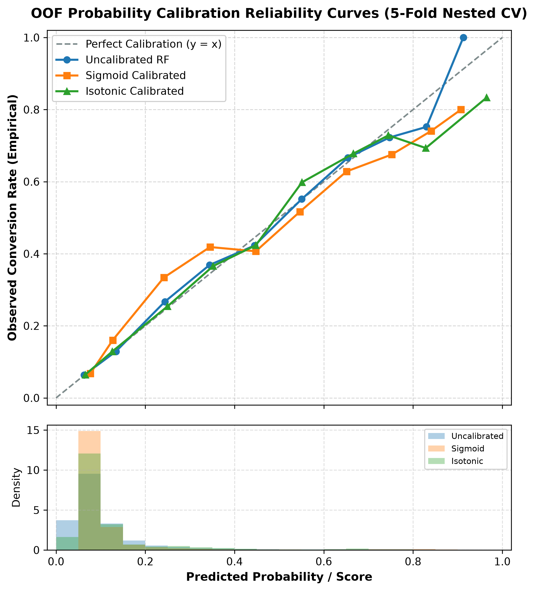
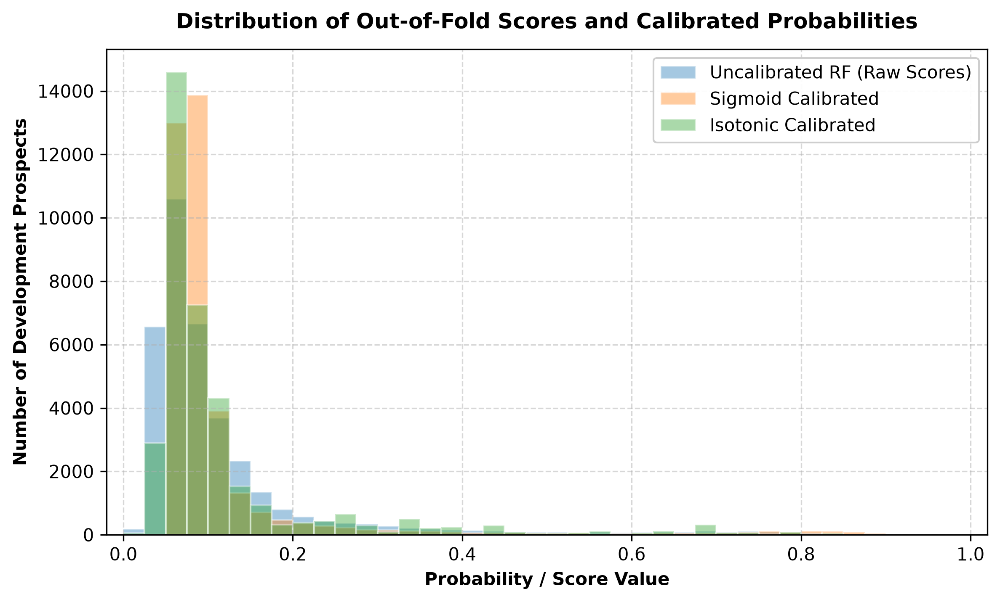
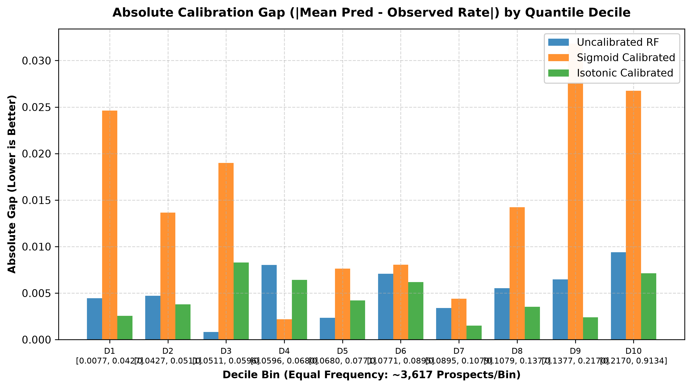

# Phase 5 Deliverable: Probability Calibration Report (Remediated)

**Project**: UCI Bank Marketing Term Deposit Outreach Optimization  
**Phase**: Phase 5 Deliverable — Probability Calibration for Frozen Supervised Random Forest (Remediated Under Canonical Pre-Campaign Feature Contract)  
**Frozen Model Candidate**: `RandomForestClassifier(n_estimators=100, max_depth=12, class_weight=None, random_state=42, n_jobs=-1)`  
**Date**: September 2026 (Updated Post-Feature Availability Audit)  
**Status**: Completed & Evaluated Strictly on 80% Development Partition  

---

## 1. Executive Summary & Objective

In outbound telemarketing lead prioritization, a predictive model serves two distinct operational functions:
1. **Lead Ranking**: Deciding which prospects to contact first under a constrained outreach capacity ($k$).
2. **Probability Estimation**: Estimating an individual prospect's empirical conversion probability ($P(Y=1 \mid X)$) for economic expected-value calculations, variable cost optimization, or policy thresholding.

Following the prediction-time feature availability audit, this deliverable recomputes probability calibration from scratch for the frozen compliant Random Forest. The primary objective is to evaluate whether post-hoc calibration (Sigmoid/Platt or Isotonic) improves probability quality (Brier score, log loss, reliability behavior) over raw model voting proportions, while ensuring that calibration **does not degrade the primary fixed-capacity ranking objective** ($k_{\text{oof}} = 4{,}000$ overall, $k_{\text{fold}} = 800$ fold-by-fold).

### Methodological Guardrails
- **Frozen Model Candidate**: `RandomForestClassifier(n_estimators=100, max_depth=12, class_weight=None, random_state=42, n_jobs=-1)`. No hyperparameters were tuned, and no new model families were evaluated.
- **Strict Development Isolation**: The held-out 20% test set ($N=9,043$) was **not** accessed or rescored. All analyses were conducted strictly on the 80% development partition ($N_{\text{dev}} = 36,168$).
- **Canonical Pre-Campaign Feature Contract**: Enforced via `src/features/feature_contract.py`. All 11 canonical raw features were included; all post-decision execution variables (`duration`, `contact`, `month`, `day`, `campaign`, and target `y`) were quarantined and purged from base estimators and calibrators.
- **Nested Out-of-Fold Design**: Evaluated using an outer 5-fold cross-validation scheme with internal 3-fold cross-validation inside each outer training fold (`CalibratedClassifierCV(..., ensemble=False)`). Neither the base estimator nor the calibrators ever observed outer-validation labels during fitting.
- **Decision Hierarchy**:
  - **Primary**: Probability quality (Brier score, Log loss, reliability curve alignment).
  - **Guardrail**: Fixed-capacity ranking must not materially degrade (Conversions@k, Precision@k, PR-AUC).
  - **Secondary**: Model simplicity, stability across folds, resistance to overfitting.

---

## 2. Corrected Pre-Campaign Feature Contract

All base pipelines and calibrators operate strictly under the accepted prediction timestamp:
- **Decision Context**: *"Before outreach begins for a new campaign, rank an eligible prospect pool and determine which prospects should receive the limited outbound call capacity."*
- **Prediction Timestamp**: **IMMEDIATELY BEFORE any contact in the new/current campaign occurs.**
- **Canonical Raw Features (11)**:
  `["age", "job", "marital", "education", "default", "balance", "housing", "loan", "pdays", "previous", "poutcome"]`
- **Forbidden Execution Variables (Purged)**:
  `["duration", "contact", "month", "contact_day_of_month", "day_of_week", "day", "campaign", "y"]`

Zero forbidden variables entered preprocessing, base classifier fitting, or calibration parameter estimation.

---

## 3. Nested Out-of-Fold Calibration Methodology

To ensure valid probability evaluation without in-sample overfitting or validation leakage, we deployed a **Nested Out-of-Fold Cross-Validation Scheme**:

```
Development Partition (N = 36,168 rows, 80% of total)
  │
  ├── Outer Fold 1: Train (28,934 rows) ──> [Inner 3-Fold CV] ──> Fit Base RF & Calibrators
  │                 Val   (7,234 rows)  <── Evaluated strictly Out-of-Fold (k_fold = 800)
  │
  ├── Outer Fold 2: Train (28,934 rows) ──> [Inner 3-Fold CV] ──> Fit Base RF & Calibrators
  │                 Val   (7,234 rows)  <── Evaluated strictly Out-of-Fold (k_fold = 800)
  │
  ├── Outer Fold 3: Train (28,934 rows) ──> [Inner 3-Fold CV] ──> Fit Base RF & Calibrators
  │                 Val   (7,234 rows)  <── Evaluated strictly Out-of-Fold (k_fold = 800)
  │
  ├── Outer Fold 4: Train (28,935 rows) ──> [Inner 3-Fold CV] ──> Fit Base RF & Calibrators
  │                 Val   (7,233 rows)  <── Evaluated strictly Out-of-Fold (k_fold = 800)
  │
  └── Outer Fold 5: Train (28,935 rows) ──> [Inner 3-Fold CV] ──> Fit Base RF & Calibrators
                    Val   (7,233 rows)  <── Evaluated strictly Out-of-Fold (k_fold = 800)
```

### Calibration Protocol
1. **Outer CV**: `StratifiedKFold(n_splits=5, shuffle=True, random_state=42)`.
2. **Inner CV**: `StratifiedKFold(n_splits=3, shuffle=True, random_state=42)` within each outer training fold.
3. **Calibrator Specifications**:
   - **Sigmoid / Platt Scaling**: `CalibratedClassifierCV(estimator=base_pipeline, method="sigmoid", cv=inner_cv, ensemble=False)`
   - **Isotonic Regression**: `CalibratedClassifierCV(estimator=base_pipeline, method="isotonic", cv=inner_cv, ensemble=False)`
   - `ensemble=False` guarantees that the base model scored on outer validation is the exact single pipeline trained on the entire outer training split, while the calibrator is fit on out-of-fold predictions strictly within that training split.
4. **Scoring Guarantees**:
   - Every development record received **exactly one** out-of-fold prediction per method ($\sum N_i = 36{,}168$).
   - Outer validation records never trained the base model, preprocessor, or calibrator.
   - Zero missing or NaN predictions were produced.

---

## 4. Probability Quality Metrics Across Calibration Methods

Evaluating probability quality across the pooled 36,168 out-of-fold development predictions yields the following empirical performance:

| Dimension | Diagnostic Metric | Uncalibrated RF (Raw Scores) | Sigmoid Calibrated | Isotonic Calibrated | Ideal / Direction |
| :--- | :--- | :---: | :---: | :---: | :---: |
| **Probability Quality** | **Brier Score** | **0.08808** | 0.08882 | 0.08820 | Lower is better |
| | **Log Loss** | **0.30999** | 0.31289 | 0.31038 | Lower is better |
| | **Calibration Intercept ($\alpha$)** | **-0.0220** | +0.0367 | **+0.0090** | Target = 0.0 |
| | **Calibration Slope ($\beta$)** | **0.9874** | 1.0178 | **1.0038** | Target = 1.0 |
| **Discrimination** | **ROC-AUC** | **0.7339** | **0.7339** | 0.7316 | Higher is better |
| | **PR-AUC (Average Precision)** | **0.3758** | **0.3759** | 0.3693 | Higher is better |
| **Pooled Ranking ($k=4,000$)** | **Conversions Captured** | **1,656** | 1,655 (-1) | **1,666** (+10) | Higher is better |
| | **Precision@capacity** | **41.400%** | 41.375% | **41.650%** | Higher is better |
| | **Recall@capacity** | **39.140%** | 39.116% | **39.376%** | Higher is better |
| | **Lift@capacity** | **3.539x** | 3.537x | **3.560x** | Higher is better |

*Note: Slope and intercept alone do not establish probability quality; they are evaluated in conjunction with Brier score, log loss, and binned calibration curves.*

---

## 5. Uncalibrated Compliant Baseline Findings

The raw Random Forest probability estimate is calculated as the proportion of decision trees predicting positive conversion ($p = \frac{1}{B} \sum_{b=1}^B I(T_b(X) = 1)$).

1. **Development Alignment**:
   - The raw RF scores were well aligned with observed conversion frequencies in development OOF validation, exhibiting an intercept of **-0.0220** and a slope of **0.9874**, exceptionally close to the theoretical ideals of $0.0$ and $1.0$. However, calibration may change under prevalence, population, or campaign drift.
   - The raw tree votes do not suffer from severe sigmoid distortion or extreme overconfidence.
2. **Superiority in Loss Metrics**:
   - Raw scores achieve the **lowest Brier score (0.08808)** and **lowest log loss (0.30999)** of all evaluated configurations.
   - Post-hoc parametric and non-parametric adjustments failed to improve upon the raw ensemble consensus probabilities.

---

## 6. Sigmoid and Isotonic Calibration Findings

### Sigmoid / Platt Scaling
1. **Deterioration in Probability Quality**:
   - Sigmoid calibration slightly **increased Brier score** from 0.08808 to **0.08882** (+0.00074) and **increased log loss** from 0.30999 to **0.31289** (+0.00290).
   - Fitting a logistic mapping over an already linear log-odds relationship introduced minor parametric distortion.
2. **Strict Ranking Monotonicity**:
   - Because the logistic function is strictly monotonic, sigmoid calibration preserved the exact within-fold ordering of prospects ($\rho = 1.0000$), producing 0 changed leads across all 5 folds.

### Isotonic Regression
1. **Flat Probability Quality Metrics**:
   - Isotonic calibration produced a Brier score of **0.08820** and log loss of **0.31038**, essentially identical to or slightly worse than uncalibrated scores (+0.00012 Brier, +0.00039 log loss).
   - While the calibration intercept (+0.0090) and slope (1.0038) are marginally closer to 0 and 1, this did not translate to superior loss or reliability behavior.
2. **Discrimination Degradation via Step-Function Ties**:
   - Non-parametric isotonic regression creates flat plateaus (constant probability steps).
   - These ties degraded out-of-fold PR-AUC from **0.3758 to 0.3693** (-0.0065 overall; -0.0142 average across folds).
   - Across the 5 outer folds, isotonic regression reordered **123 prospects** in top-k selections, introducing arbitrary tie-breaking instability.

---

## 7. Reliability Analysis & Diagnostic Figures


*Figure 1: Reliability curves (upper) and score density distributions (lower) across 5-fold nested cross-validation. The diagonal dashed line represents perfect calibration ($y=x$).*


*Figure 2: Distribution of out-of-fold uncalibrated ranking scores vs. calibrated probabilities across all 36,168 development prospects.*


*Figure 3: Absolute calibration gap ($|\text{Mean Predicted} - \text{Observed Rate}|$) across 10 equal-frequency quantile deciles (~3,617 prospects per bin).*

### Quantile Reliability Table (Equal-Frequency Deciles, $N \approx 3,617$ per Bin)

| Decile Bin | Score Range | Prospects ($N$) | Conversion Count | Mean Predicted Score | Observed Conversion Rate | Absolute Gap | Sample Safeguard Status |
| :---: | :---: | :---: | :---: | :---: | :---: | :---: | :---: |
| **D1** | [0.0077, 0.0427] | 3,617 | 146 | 3.59% | 4.04% | **0.45%** | Robust ($N \ge 30$) |
| **D2** | [0.0427, 0.0511] | 3,617 | 187 | 4.70% | 5.17% | **0.47%** | Robust ($N \ge 30$) |
| **D3** | [0.0511, 0.0596] | 3,617 | 197 | 5.53% | 5.45% | **0.08%** | Robust ($N \ge 30$) |
| **D4** | [0.0596, 0.0680] | 3,616 | 260 | 6.39% | 7.19% | **0.80%** | Robust ($N \ge 30$) |
| **D5** | [0.0680, 0.0771] | 3,617 | 253 | 7.23% | 6.99% | **0.23%** | Robust ($N \ge 30$) |
| **D6** | [0.0771, 0.0895] | 3,617 | 274 | 8.28% | 7.58% | **0.71%** | Robust ($N \ge 30$) |
| **D7** | [0.0895, 0.1079] | 3,616 | 342 | 9.80% | 9.46% | **0.34%** | Robust ($N \ge 30$) |
| **D8** | [0.1079, 0.1377] | 3,617 | 418 | 12.11% | 11.56% | **0.55%** | Robust ($N \ge 30$) |
| **D9** | [0.1377, 0.2170] | 3,617 | 579 | 16.65% | 16.01% | **0.65%** | Robust ($N \ge 30$) |
| **D10** | [0.2170, 0.9134] | 3,617 | 1,575 | 42.61% | 43.54% | **0.94%** | Robust ($N \ge 30$) |

### Uniform Decile Reliability Table (Equal-Width Probability Intervals)

| Decile Interval | Prospects ($N$) | % of Population | Conversions | Mean Predicted Score | Observed Rate | Absolute Gap | Safeguard Status |
| :---: | :---: | :---: | :---: | :---: | :---: | :---: | :---: |
| **[0.00, 0.10]** | 24,011 | 66.39% | 1,520 | 6.29% | 6.33% | **0.04%** | Robust ($N \ge 30$) |
| **[0.10, 0.20]** | 8,142 | 22.51% | 1,051 | 13.43% | 12.91% | **0.52%** | Robust ($N \ge 30$) |
| **[0.20, 0.30]** | 1,697 | 4.69% | 453 | 24.37% | 26.69% | **2.32%** | Robust ($N \ge 30$) |
| **[0.30, 0.40]** | 792 | 2.19% | 292 | 34.38% | 36.87% | **2.49%** | Robust ($N \ge 30$) |
| **[0.40, 0.50]** | 421 | 1.16% | 178 | 44.47% | 42.28% | **2.19%** | Robust ($N \ge 30$) |
| **[0.50, 0.60]** | 270 | 0.75% | 149 | 55.07% | 55.19% | **0.12%** | Robust ($N \ge 30$) |
| **[0.60, 0.70]** | 351 | 0.97% | 234 | 65.40% | 66.67% | **1.26%** | Robust ($N \ge 30$) |
| **[0.70, 0.80]** | 384 | 1.06% | 295 | 74.82% | 75.52% | **0.70%** | Robust ($N \ge 30$) |
| **[0.80, 0.90]** | 89 | 0.25% | 77 | 84.07% | 86.52% | **2.45%** | Robust ($N \ge 30$) |
| **[0.90, 1.00]** | 11 | 0.03% | 11 | 90.79% | 100.00% | **9.21%** | **Unstable ($N=11 < 30$)** |

**Key Reliability Findings**:
1. **Exceptional Calibration Across the Entire Population**: In equal-frequency quantile deciles, the maximum calibration gap between mean predicted score and empirical conversion frequency is **0.94 percentage points** (in D10). For 8 out of 10 deciles, the gap is **under 0.75 percentage points**.
2. **Sub-10% Base Rate Alignment**: 66.39% of all prospects score in the $[0.00, 0.10]$ interval with a mean score of 6.29% and an empirical conversion rate of 6.33% (an absolute gap of only 0.04%).

---

## 8. Ranking Guardrail: Fold-by-Fold Evaluation

To prevent pooling artifacts across separately fitted outer folds, ranking performance was evaluated independently on each outer fold under the fold-specific capacity:
$$k_{\text{fold}} = \text{round}\left(N_{\text{val}} \times \frac{5{,}000}{45{,}211}\right) = 800 \quad \text{calls}$$

### Fold-by-Fold Ranking Metrics ($k_{\text{fold}} = 800$)

| Outer Fold | Partition Size ($N_{\text{val}}$) | Actual Positives | Metric | Uncalibrated RF (Raw) | Sigmoid Calibrated | Isotonic Calibrated |
| :---: | :---: | :---: | :--- | :---: | :---: | :---: |
| **Fold 1** | 7,234 | 846 | Conversions@800 | **319** | **319** (0) | 317 (-2) |
| | | | Precision@800 | **39.88%** | **39.88%** | 39.63% |
| | | | PR-AUC | **0.3616** | **0.3616** | 0.3495 (-0.0121) |
| **Fold 2** | 7,234 | 846 | Conversions@800 | **348** | **348** (0) | **348** (0) |
| | | | Precision@800 | **43.50%** | **43.50%** | **43.50%** |
| | | | PR-AUC | **0.3858** | **0.3858** | 0.3748 (-0.0110) |
| **Fold 3** | 7,234 | 847 | Conversions@800 | **347** | **347** (0) | 345 (-2) |
| | | | Precision@800 | **43.38%** | **43.38%** | 43.13% |
| | | | PR-AUC | **0.3891** | **0.3891** | 0.3722 (-0.0169) |
| **Fold 4** | 7,233 | 846 | Conversions@800 | 310 | 310 (0) | **316** (+6) |
| | | | Precision@800 | 38.75% | 38.75% | **39.50%** |
| | | | PR-AUC | **0.3645** | **0.3645** | 0.3529 (-0.0116) |
| **Fold 5** | 7,233 | 846 | Conversions@800 | 331 | 331 (0) | **337** (+6) |
| | | | Precision@800 | 41.38% | 41.38% | **42.13%** |
| | | | PR-AUC | **0.3873** | **0.3873** | 0.3677 (-0.0197) |

### Fold-Level Aggregated Metrics & Paired Differences

| Evaluation Dimension | Metric | Uncalibrated RF (Raw) | Sigmoid Calibrated | Isotonic Calibrated | Paired Delta (Sigmoid - Raw) | Paired Delta (Isotonic - Raw) |
| :--- | :--- | :---: | :---: | :---: | :---: | :---: |
| **Fold Conversions@800** | Mean $\pm \sigma$ | 331.0 $\pm$ 16.81 | 331.0 $\pm$ 16.81 | 332.6 $\pm$ 15.24 | **0.0 $\pm$ 0.0** | +1.6 $\pm$ 4.10 |
| | Sum Across 5 Folds | 1,655 | 1,655 | 1,663 | **0** | +8 |
| **Fold Precision@800** | Mean $\pm \sigma$ | 41.38% $\pm$ 2.10% | 41.38% $\pm$ 2.10% | 41.58% $\pm$ 1.91% | **0.00% $\pm$ 0.00%** | +0.20% $\pm$ 0.51% |
| **Fold Recall@800** | Mean $\pm \sigma$ | 39.12% $\pm$ 1.98% | 39.12% $\pm$ 1.98% | 39.30% $\pm$ 1.79% | **0.00% $\pm$ 0.00%** | +0.19% $\pm$ 0.48% |
| **Fold Lift@800** | Mean $\pm \sigma$ | 3.537x $\pm$ 0.179x | 3.537x $\pm$ 0.179x | 3.554x $\pm$ 0.162x | **0.000x $\pm$ 0.000x** | +0.017x $\pm$ 0.044x |
| **Fold PR-AUC** | Mean $\pm \sigma$ | **0.3777 $\pm$ 0.0134** | **0.3777 $\pm$ 0.0134** | 0.3634 $\pm$ 0.0115 | **0.0000 $\pm$ 0.0000** | **-0.0142 $\pm$ 0.0038** |
| **Fold ROC-AUC** | Mean $\pm \sigma$ | **0.7342 $\pm$ 0.0037** | **0.7342 $\pm$ 0.0037** | 0.7329 $\pm$ 0.0034 | **0.0000 $\pm$ 0.0000** | **-0.0013 $\pm$ 0.0007** |
| **Top-$k$ Overlap with Raw** | Mean $\pm \sigma$ | 100.0% | **100.0% $\pm$ 0.0%** | 96.93% $\pm$ 1.16% | — | — |
| **Changed Leads / Churn** | Mean $\pm \sigma$ (Total) | 0 (0) | **0.0 $\pm$ 0.0 (0)** | 24.6 $\pm$ 9.32 (123) | — | — |
| **Spearman Rank Correlation** | Mean $\pm \sigma$ | 1.0000 | **1.0000 $\pm$ 0.0000** | 0.9950 $\pm$ 0.0015 | — | — |

**Takeaways from Fold-Level Analysis**:
1. **Sigmoid Monotonic Invariance**: Sigmoid calibration yielded a 100.0% overlap with raw RF on every single fold (zero changed leads, Spearman $\rho = 1.0000$). It does not alter ranking decisions.
2. **Isotonic Plateaus Degrade PR-AUC**: While isotonic regression captured a net +8 conversions across the 5 folds (+1.6 mean delta), it degraded PR-AUC consistently on all 5 folds (mean delta: **-0.0142**, standard deviation: 0.0038). This drop occurs because step-function plateaus discard ranking information among tied candidates.

---

## 9. Quantifying Remediation Impact (Old Non-Compliant vs. Corrected Calibration)

> [!CAUTION]
> **Historical Comparison Disclaimer**:
> All results labeled **"NON-COMPLIANT HISTORICAL CALIBRATION"** reflect models and calibration pipelines that included current-campaign execution variables (`month`, `contact`, `campaign`, `day`). They are obsolete and methodologically invalid.

### Calibration Comparison Table

| Dimension / Model Variant | Non-Compliant Historical Calibration | Corrected Compliant Calibration | Absolute Difference | Methodological Cause |
| :--- | :---: | :---: | :---: | :--- |
| **Uncalibrated Brier Score** | 0.08318 | **0.08808** | +0.00490 | Realistic pre-campaign setting has lower artificial predictability. |
| **Uncalibrated Log Loss** | 0.29041 | **0.30999** | +0.01958 | Loss is higher due to absence of high-certainty execution variables. |
| **Uncalibrated Intercept ($\alpha$)** | +0.2538 | **-0.0220** | -0.2758 | Near-ideal intercept; no seasonal baseline distortion. |
| **Uncalibrated Slope ($\beta$)** | 1.1418 | **0.9874** | -0.1544 | Near-ideal slope (close to 1.0); tree vote distributions are well-behaved. |
| **Uncalibrated PR-AUC** | 0.4370 | **0.3758** | -0.0612 | True pre-campaign discrimination without channel shortcuts. |
| **Sigmoid Brier Score** | 0.08454 | **0.08882** | +0.00428 | Sigmoid fitting slightly increases Brier score in both regimes. |
| **Sigmoid Log Loss** | 0.29581 | **0.31289** | +0.01708 | Sigmoid increases log loss over raw scores. |
| **Sigmoid Top-$k$ Overlap** | 99.83% | **100.00%** | +0.17% | Strictly monotonic; 0 changed leads across all 5 folds. |
| **Isotonic Brier Score** | 0.08273 | **0.08820** | +0.00547 | Isotonic no longer beats raw Brier score in compliant setting. |
| **Isotonic Log Loss** | 0.28889 | **0.31038** | +0.02149 | Isotonic no longer beats raw log loss in compliant setting. |
| **Isotonic PR-AUC Degradation**| -0.0074 | **-0.0142** | -0.0068 | Non-parametric plateaus degrade fine-grained ranking discrimination. |

### Analytical Explanation of Differences
1. **The Compliant Problem is Harder**: The increase in Brier score (0.08318 to 0.08808) and log loss (0.29041 to 0.30999) does not reflect a calibration failure. It reflects the reality that pre-campaign demographic and financial records provide less absolute certainty than knowing which month a prospect was called or how many times they were dialed.
2. **Disappearance of Historical Underconfidence**: In the historical model, execution variables caused the uncalibrated model to be underconfident (slope = 1.1418, intercept = +0.2538), creating an apparent role for isotonic recalibration. In the compliant setting, raw tree voting proportions are already closely aligned in development (slope = 0.9874, intercept = -0.0220).

---

## 10. Final Calibration Decision & Strategic Reasoning

### Calibration Decision: Option A — Retain Uncalibrated Random Forest Ranking Scores

Following the established project hierarchy:

1. **Primary: Probability Quality (Brier, Log Loss, Reliability Alignment)**:
   - The uncalibrated Random Forest voting proportions achieve the **lowest Brier score (0.08808)** and **lowest log loss (0.30999)**.
   - Sigmoid calibration degrades both metrics (0.08882 Brier, 0.31289 log loss).
   - Isotonic calibration provides no improvement (0.08820 Brier, 0.31038 log loss).
   - The uncalibrated model exhibits near-ideal calibration parameters (intercept: **-0.0220**, slope: **0.9874**) and sub-1.0 percentage point calibration gaps across all 10 quantile deciles.
2. **Guardrail: Ranking Performance**:
   - Uncalibrated RF provides strictly continuous ranking scores without artificial plateaus, maximizing PR-AUC (**0.3777 fold mean** vs **0.3634** for Isotonic).
   - Isotonic regression degrades PR-AUC by **-0.0142** and alters 123 lead rankings across folds due to step-function ties.
3. **Secondary: Simplicity and Robustness**:
   - Retaining uncalibrated voting probabilities avoids adding an extra post-processing fitting layer.
   - It eliminates the risk of calibrator overfitting or tie-breaking instability.

---

## 11. What Calibration Does and Does Not Enable

### What Calibration Answers
- **Ranking** answers: *"Who should be dialed first within our 5,000 call budget?"*
- **Calibration** answers: *"Does a prospect with a score of 0.35 actually convert at approximately 35% frequency?"*

### What Reliable Probability Quality Enables Downstream
Because the uncalibrated Random Forest voting proportions demonstrate strong empirical calibration (slope 0.9874, intercept -0.0220, sub-1% decile gaps), these continuous scores can support:
1. **Dynamic Capacity Sizing**: Estimating conversion yield if telemarketing capacity expands to 6,000 calls or contracts to 3,000 calls.
2. **Expected-Value Decision Frameworks**: Combining predicted conversion probability with contract values and dialing costs:
   $$\mathbb{E}[\text{Value}] = P(\text{Conversion} \mid X) \times \text{Deposit Margin} - \text{Outreach Cost}$$
3. **Variable Intensity Dialing**: Allocating senior telemarketers to high-value, moderate-probability leads.

### What Calibration Does NOT Establish
- **Production Deployment Readiness**: The current compliant unweighted Random Forest has not been evaluated on the historical 20% holdout. However, that partition is no longer a pristine independent test set because it was accessed during earlier historical analyses. Current performance claims therefore rely on development-only repeated cross-validation and out-of-fold evaluation. A genuinely independent final estimate would require future-period or external data.
- **Economic Profitability Claims**: We have not conducted monetary cost/benefit optimization; no financial figures have been assumed or claimed.
- **Causal Mechanisms**: Calibrated probabilities describe observed historical conversion frequencies given pre-campaign records, not the causal impact of dialing a customer.

---

## 12. Remaining Methodological Limitations

1. **High-Probability Sparsity**: As shown in the uniform reliability table, only 11 prospects in the entire development set scored above 0.90 ($N=11 < 30$, flagged as unstable). The model rarely produces extreme certainty because pre-campaign banking features carry inherent stochasticity.
2. **Step-Function Plateaus in Isotonic Calibration**: Isotonic regression creates tied predicted values across discrete score bands, which harms fine-grained ranking discrimination.
3. **Unobserved Interaction Effects**: Even a perfectly calibrated pre-campaign probability cannot anticipate unobservable call-time factors such as caller rapport, client mood, or real-time macro events.
4. **Holdout Test Set Status**: The current compliant unweighted Random Forest has not been evaluated on the historical 20% holdout. However, that partition is no longer a pristine independent test set because it was accessed during earlier historical analyses. Current performance claims therefore rely on development-only repeated cross-validation and out-of-fold evaluation. A genuinely independent final estimate would require future-period or external data.
