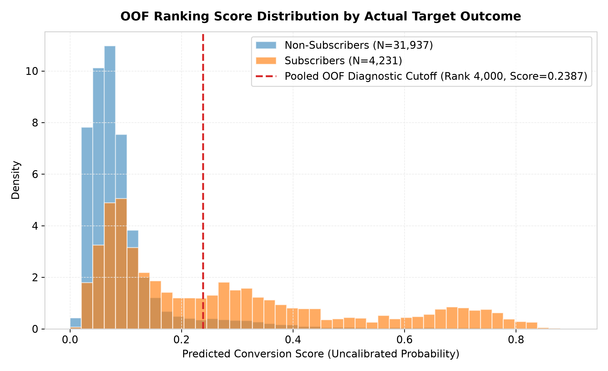
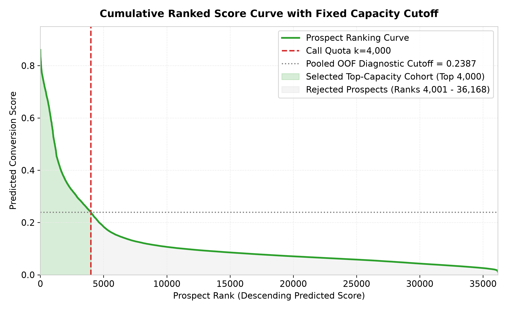
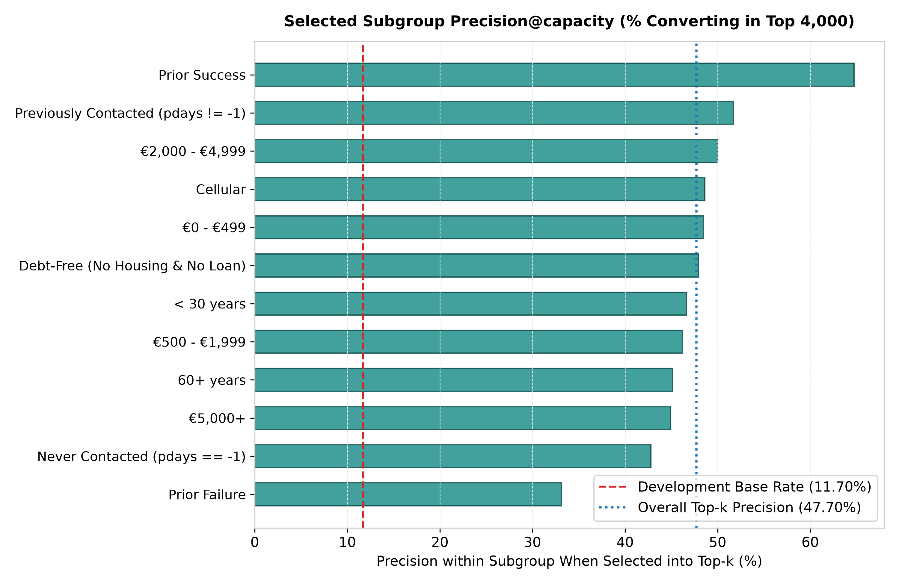
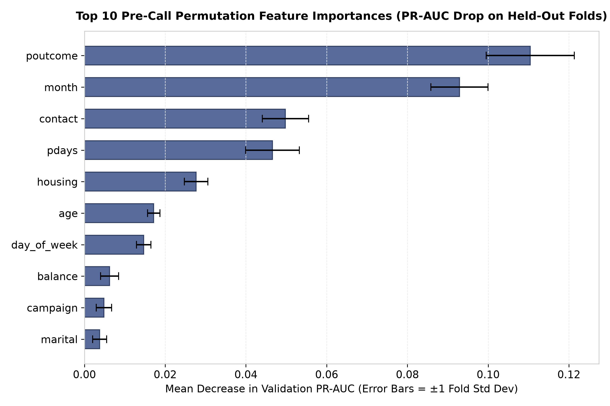
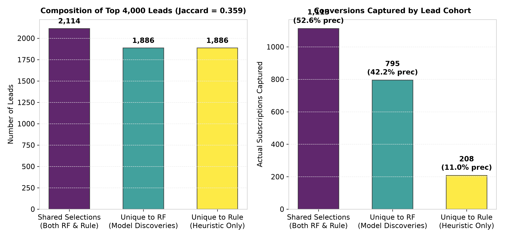

# Phase 4 Deliverable: Supervised Model Interpretation & Error Analysis Report

**Project**: UCI Bank Marketing Term Deposit Outreach Optimization  
**Phase**: Phase 4 Deliverable — Supervised Model Interpretation & Error Analysis  
**Frozen Model Candidate**: `RandomForestClassifier(n_estimators=100, max_depth=12, class_weight=None, random_state=42, n_jobs=-1)`  
**Date**: September 2026  
**Status**: Completed & Evaluated on Development Partition  

---

## 1. Executive Summary & Objective

The primary objective of this phase is to conduct an in-depth forensic investigation into the behavior, ranking mechanisms, subgroup performance, and failure modes of the **frozen supervised candidate model** (`RandomForest(class_weight=None)`).

Under an operational outreach capacity constraint ($\text{capacity\_fraction} = 5{,}000 / 45{,}211 \approx 0.11059$), the goal is not model selection or hyperparameter tuning, but diagnostic understanding:
1. **Feature Utilization**: Which pre-call customer attributes influence the model's prioritization ranking?
2. **Ranking Successes & Error Categorization**: How does the model perform within the top-capacity cohort, and what is the exact observable profile of False Positives and Missed Positives?
3. **Subgroup Heterogeneity**: Which customer demographics and historical interaction segments correspond to strong performance, and where does predictive resolution degrade?
4. **Differentiation from Domain Heuristics**: How do the prospects selected by Random Forest differ from those chosen by the frozen Business-Rule baseline, and what accounts for the model's conversion advantage?

### Methodological Guardrails
- **Frozen Architecture**: No new model families, hyperparameter tuning, or probability calibration were introduced.
- **Partition Isolation**: The held-out 20% test set (9,043 records) was **not** revisited during this analysis; its previously recorded single evaluation remains frozen.
- **Development-Only Diagnostics**: All out-of-fold (OOF) predictions, subgroup breakdowns, permutation importances, and error profiling were conducted strictly on the 80% development partition (36,168 records).
- **Leakage Contract**: Post-call `duration` was programmatically quarantined and stripped before all preprocessing, modeling, and feature importance workflows.
- **Capacity Constraint**: Evaluated at $k_{\text{oof}} = \text{round}(36{,}168 \times 5{,}000 / 45{,}211) = 4{,}000$ contacts.

---

## 2. Diagnostic Methodology & Development OOF Design

To evaluate ranking error without in-sample training optimism and without snooping the frozen test partition, an **Out-of-Fold (OOF) Cross-Validation Scheme** was executed:

```
Development Partition (N = 36,168 records, 80% of total)
  ├── Fold 1 Val (7,234 rows) <── Predicted by RF fit on Folds 2-5 Train (28,934 rows)
  ├── Fold 2 Val (7,234 rows) <── Predicted by RF fit on Folds 1,3-5 Train (28,934 rows)
  ├── Fold 3 Val (7,234 rows) <── Predicted by RF fit on Folds 1-2,4-5 Train (28,934 rows)
  ├── Fold 4 Val (7,233 rows) <── Predicted by RF fit on Folds 1-3,5 Train (28,935 rows)
  └── Fold 5 Val (7,233 rows) <── Predicted by RF fit on Folds 1-4 Train (28,935 rows)
```

### Protocol & Verification
1. **Resampling**: `StratifiedKFold(n_splits=5, shuffle=True, random_state=42)`.
2. **Strict Isolation**: For every fold, the full pre-call pipeline (`PreCallFeatureEngineer` + `ColumnTransformer`) was fit exclusively on that fold's training split.
3. **Integrity Guarantees**:
   - Every development row received **exactly one** out-of-fold prediction ($\sum N_i = 36{,}168$).
   - Zero training observations were scored by a model trained on their own data.
   - Zero missing scores or infinite values were produced.
   - Post-call `duration` was absent from all pipelines.

> [!IMPORTANT]
> **Diagnostic Nature of OOF Metrics**: OOF predictions eliminate training-set memorization, but they are development-partition diagnostics. They do **not** represent a new, independent estimate of final production generalization performance.

---

## 3. Capacity-Based Ranking Performance ($k_{\text{oof}} = 4{,}000$)

Because outbound telemarketing operates under a hard outreach quota, default classification thresholds (e.g. 0.50) are economically irrelevant. Prospect lists are formed by selecting the top $k_{\text{oof}} = 4{,}000$ prospects ranked descending by predicted conversion score.

### Formal Ranking Error Categories

```
                           Actual Positive (Subscriber)      Actual Negative (Non-Subscriber)
Selected in Top 4,000       Top-k True Positive (TP = 1,908)   Top-k False Positive (FP = 2,092)   ---> Selected = 4,000 (k)
Rejected (Ranks 4,001+)     Missed Positive (FN = 2,323)       Correctly Rejected (TN = 29,845)   ---> Rejected = 32,168
                                    |                                         |
                                    v                                         v
                         Total Positives = 4,231                  Total Negatives = 31,937         ---> Total Dev = 36,168
```

### Empirical Capacity Ranking Metrics

| Metric | Development OOF Value | Operational Interpretation |
| :--- | :---: | :--- |
| **Development Population ($N_{\text{dev}}$)** | **36,168** | Eligible prospects in 80% development partition. |
| **Outreach Capacity ($k_{\text{oof}}$)** | **4,000** | Budgeted call volume ($11.059\%$ capacity fraction). |
| **Conversions Captured ($TP$)** | **1,908** | Subscribed term deposits within top 4,000 calls. |
| **Top-k False Positives ($FP$)** | **2,092** | Non-converting prospects contacted in top 4,000 calls. |
| **Missed Positives ($FN$)** | **2,323** | Actual subscribers not reached within top 4,000 calls. |
| **Correctly Rejected ($TN$)** | **29,845** | Non-subscribers correctly excluded from call campaign. |
| **Precision@capacity** | **47.70%** | Nearly 1 out of every 2 calls placed results in a subscription. |
| **Recall@capacity** | **45.10%** | Captures $45.1\%$ of all available subscribers in top $11.1\%$ calls. |
| **Lift@capacity** | **4.08x** | Delivers 4.08 times more conversions than random dialing. |
| **Pooled OOF Diagnostic Capacity Cutoff** | **0.2387** | Prospect ranking score required to secure rank $\le 4{,}000$. |

### Mathematical Reconciliation Checks
- $TP + FP = 1{,}908 + 2{,}092 = 4{,}000 = k_{\text{oof}}$ (Exact)
- $TP + FN = 1{,}908 + 2{,}323 = 4{,}231 = \text{Total Positives}$ (Exact)
- $TP + FP + FN + TN = 1{,}908 + 2{,}092 + 2{,}323 + 29{,}845 = 36{,}168 = N_{\text{dev}}$ (Exact)

---

## 4. Score-Distribution Findings & Cutoff Terminology


*Figure 1: Distribution of OOF predicted conversion scores for actual subscribers ($y=\text{'yes'}$) vs. non-subscribers ($y=\text{'no'}$). The dashed red line denotes the pooled OOF diagnostic capacity cutoff ($0.2387$).*


*Figure 2: Descending ranked score curve across all 36,168 development prospects, highlighting the selected top-capacity cohort (green) versus the rejected population (grey).*

### Analytical Insights from Score Distributions
1. **Bimodal Separation with Substantial Overlap**:
   - Non-subscribers are heavily clustered near zero: median score is **0.052**, mean is **0.098**, and 75% of non-subscribers score below **0.138**.
   - Actual subscribers exhibit a broad distribution with a heavy upper tail: median score is **0.183**, mean is **0.272**, and 45.1% score above the cutoff of **0.2387**.
2. **The Nature of the Pooled OOF Diagnostic Capacity Cutoff**:
   - The capacity threshold corresponds to a score of **$0.2387$**.
   - **Crucial Methodological Caveat**: This score is formally a **pooled OOF diagnostic capacity cutoff**. It is formed by aggregating out-of-fold predictions produced across five separately fitted fold models. While highly valuable for development diagnostics:
     - It is **not** a deployable operating threshold for production scoring.
     - Model scores are currently uncalibrated.
     - Absolute score comparability across separately fitted fold models is not mathematically guaranteed.
3. **Threshold vs. Capacity Outreach**:
   - Prospects with scores $\ge 0.50$ number only **1,108** in total. If a traditional 0.50 decision threshold had been applied, the sales team would have contacted only 1,108 customers, underutilizing available call capacity by **72.3%** and capturing only 876 conversions (leaving over 1,030 viable conversions on the table).

---

## 5. Subgroup Performance Breakdown


*Figure 3: Selected subgroup Precision@capacity (% converting in top 4,000) for key customer cohorts compared against population base rate (red dashed line) and overall top-k precision (blue dotted line). Subgroups with $N_{\text{selected}} < 30$ are omitted to prevent small-sample distortion.*

### Prior-Contact Canonical Contract Audit
An audit was conducted on the source data column `pdays`:
- `pdays == 0`: **0 records (0.0%)**
- `pdays == -1`: **36,954 records (81.7%)** (Never contacted previously)
- `pdays > 0`: **8,257 records (18.3%)** (Previously contacted; values range from 1 to 871 days)
Because zero records have `pdays == 0`, the conditions `pdays > 0` and `pdays != -1` are strictly mathematically equivalent in this dataset. However, in accordance with the project's canonical feature contract, all code and reporting are formally standardized on **`pdays != -1`**.

### Small-Subgroup Safeguards
To prevent misleading conclusions drawn from small sample sizes, a minimum selected-sample safeguard of **$N_{\text{selected}} \ge 30$** is enforced for interpreting subgroup precision:
- Subgroups with $N_{\text{selected}} < 30$ have their raw counts reported, but precision estimates are formally flagged as **`[Unstable: N < 30]`**.
- **Crucial Rule**: In particular, **do not substantively interpret the dual-loan subgroup precision based on only 13 selected prospects** ($N=13$, conversions=6).

### Subgroup Performance Table

| Dimension | Subgroup | Population ($N$) | Prevalence | Selected in Top-k | Selection Rate | Conversions Captured | Precision@k | Recall@k | Lift@k | Mean Score |
| :--- | :--- | :---: | :---: | :---: | :---: | :---: | :---: | :---: | :---: | :---: |
| **Contact History** | **Previously Contacted (`pdays != -1`)** | 6,616 | 23.08% | 2,176 | 32.89% | 1,170 | **53.77%** | **76.62%** | 2.33x | 0.2393 |
| | **Never Contacted (`pdays == -1`)** | 29,552 | 9.15% | 1,824 | 6.17% | 738 | **40.46%** | **27.29%** | 4.42x | 0.0883 |
| **Prior Outcome** | **Prior Success** | 1,222 | 64.57% | 1,202 | 98.36% | 779 | **64.81%** | **98.73%** | 1.00x | 0.6548 |
| | **Prior Failure** | 3,923 | 12.72% | 531 | 13.54% | 219 | **41.24%** | 43.89% | 3.24x | 0.1633 |
| | **Prior Other** | 1,471 | 16.25% | 443 | 30.12% | 172 | **38.83%** | 71.97% | 2.39x | 0.2030 |
| | **Prior Unknown / Missing** | 29,552 | 9.15% | 1,824 | 6.17% | 738 | **40.46%** | 27.29% | 4.42x | 0.0883 |
| **Debt Burden** | **Debt-Free (No Housing & No Loan)** | 14,357 | 16.92% | 3,197 | 22.27% | 1,530 | **47.86%** | **62.99%** | 2.83x | 0.1601 |
| | **Housing Loan Only** | 15,960 | 7.88% | 673 | 4.22% | 324 | **48.14%** | 25.76% | 6.11x | 0.0877 |
| | **Personal Loan Only** | 1,972 | 8.98% | 117 | 5.93% | 48 | **41.03%** | 27.12% | 4.57x | 0.0988 |
| | **Dual Loan Burden (Both)** | 3,879 | 6.75% | 13 | 0.34% | 6 | *[Unstable: N=13 < 30]* | 2.29% | — | 0.0768 |
| **Balance Tiers** | **< €0** | 2,981 | 5.60% | 24 | 0.80% | 14 | *[Unstable: N=24 < 30]* | 8.38% | — | 0.0833 |
| | **€0 - €499** | 15,855 | 9.92% | 1,277 | 8.05% | 619 | **48.47%** | 39.35% | 4.89x | 0.1005 |
| | **€500 - €1,999** | 10,511 | 12.98% | 1,388 | 13.21% | 641 | **46.18%** | 47.00% | 3.56x | 0.1293 |
| | **€2,000 - €4,999** | 4,519 | 17.13% | 888 | 19.65% | 444 | **50.00%** | 57.36% | 2.92x | 0.1580 |
| | **€5,000+** | 2,282 | 15.73% | 423 | 18.54% | 190 | **44.92%** | 52.92% | 2.86x | 0.1610 |
| **Age Tiers** | **< 30 years** | 4,270 | 17.54% | 851 | 19.93% | 397 | **46.65%** | 53.00% | 2.66x | 0.1572 |
| | **30 - 39 years** | 14,481 | 10.59% | 1,143 | 7.89% | 547 | **47.86%** | 35.66% | 4.52x | 0.1062 |
| | **40 - 49 years** | 9,323 | 9.16% | 600 | 6.44% | 312 | **52.00%** | 36.53% | 5.68x | 0.0947 |
| | **50 - 59 years** | 6,647 | 9.12% | 491 | 7.39% | 239 | **48.68%** | 39.44% | 5.34x | 0.1030 |
| | **60+ years** | 1,447 | 33.72% | 915 | 63.23% | 413 | **45.14%** | **84.63%** | 1.34x | 0.3067 |
| **Campaign Contacts** | **1 contact** | 14,026 | 14.59% | 2,256 | 16.08% | 1,105 | **48.98%** | **54.01%** | 3.36x | 0.1387 |
| | **2 contacts** | 10,023 | 11.15% | 1,013 | 10.11% | 485 | **47.88%** | 43.38% | 4.29x | 0.1133 |
| | **3 contacts** | 4,412 | 11.26% | 368 | 8.34% | 180 | **48.91%** | 36.22% | 4.34x | 0.1055 |
| | **4 - 5 contacts** | 4,224 | 8.66% | 248 | 5.87% | 107 | **43.15%** | 29.24% | 4.98x | 0.0933 |
| | **6 - 10 contacts** | 2,538 | 6.50% | 101 | 3.98% | 28 | **27.72%** | 16.97% | 4.26x | 0.0839 |
| | **> 10 contacts** | 945 | 4.13% | 14 | 1.48% | 3 | *[Unstable: N=14 < 30]* | 7.69% | — | 0.0690 |
| **Contact Channel** | **Cellular** | 23,465 | 14.83% | 3,500 | 14.92% | 1,702 | **48.63%** | **48.89%** | 3.28x | 0.1450 |
| | **Telephone** | 2,317 | 13.94% | 442 | 19.08% | 187 | **42.31%** | 57.89% | 3.03x | 0.1484 |
| | **Unknown Channel** | 10,386 | 4.11% | 58 | 0.56% | 19 | **32.76%** | 4.45% | 7.97x | 0.0457 |
| **Outreach Month**| **March** | 391 | 50.90% | 363 | 92.84% | 182 | **50.14%** | **91.46%** | 0.99x | 0.4118 |
| | **September** | 451 | 45.23% | 359 | 79.60% | 179 | **49.86%** | **87.75%** | 1.10x | 0.3861 |
| | **October** | 592 | 43.75% | 507 | 85.64% | 242 | **47.73%** | **93.44%** | 1.09x | 0.3815 |
| | **December** | 178 | 47.19% | 132 | 74.16% | 71 | **53.79%** | **84.52%** | 1.14x | 0.3740 |
| | **May** | 11,062 | 6.68% | 305 | 2.76% | 130 | **42.62%** | **17.59%** | 6.38x | 0.0690 |

---

## 6. Forensic Error Analysis: False Positives vs. Missed Positives

Understanding the specific traits of misranked prospects is essential for diagnosing the boundaries of pre-call predictive capability.

### Error Cohort Comparison Matrix

| Customer Attribute | Top-k True Positives ($TP = 1,908$) | Top-k False Positives ($FP = 2,092$) | Missed Positives ($FN = 2,323$) | Correctly Rejected ($TN = 29,845$) |
| :--- | :---: | :---: | :---: | :---: |
| **Mean Predicted Score** | **0.47** | **0.38** | **0.11** | **0.08** |
| **Mean Age** | 44.2 years | 44.5 years | 39.5 years | 40.5 years |
| **Median Balance** | **€1,026** | **€1,100** | **€560** | **€391** |
| **Previously Contacted (`pdays != -1`)** | **59.70%** | **50.86%** | **15.71%** | **13.46%** |
| **Prior Campaign Success (`poutcome`)** | **40.83%** | **20.27%** | **0.00%** | **0.01%** |
| **Debt-Free (No Housing, No Loan)** | **80.19%** | **79.45%** | **41.76%** | **31.97%** |
| **Holding Housing Loan** | **17.66%** | **18.16%** | **52.48%** | **61.14%** |
| **Cellular Contact Channel** | **89.20%** | **85.95%** | **76.58%** | **60.93%** |
| **Mean Campaign Contacts** | 1.77 | 1.87 | 2.27 | 2.87 |

### Profile of Top-k False Positives ($FP = 2,092$)
- **High Demographic & Financial Convergence**: Top-k False Positives share almost identical observable profiles with True Positives: mean age (44.5 vs 44.2 years), debt-free proportion (79.5% vs 80.2%), and cellular contact (86.0% vs 89.2%). In fact, False Positives have a slightly *higher* median balance (€1,100 vs €1,026).
- **Prior Success Attrition**: Over **20.27% of False Positives (424 prospects)** were prior campaign successes (`poutcome == 'success'`). While ~65% of prior winners re-subscribe, ~35% decline.
- **Analytical Takeaway**: Top-k True Positives and False Positives are **difficult to distinguish using the observed pre-call features**. Possible explanations for why these highly ranked prospects did not convert include unobserved customer variables (e.g. current cash needs, life events, competing deposit yields), omitted predictors, data limitations, model limitations, temporal macro effects, and stochastic customer decision-making. The available data do not establish which explanation is responsible.

### Profile of Missed Positives ($FN = 2,323$)
- **Overwhelmingly First-Time Contacts**: Over **84.29% of Missed Positives (1,958 out of 2,323)** have never been contacted previously (`pdays == -1`).
- **Absence of Historical Signals**: Not a single Missed Positive had a prior success ($0.00\%$).
- **Subscribing Despite Liabilities**: Over **52.48% of Missed Positives hold housing loans**, and only 41.76% are debt-free. Their median balance is €560 (vs €1,026 for TP).
- **Analytical Takeaway**: **The current feature set and frozen Random Forest provide limited separation for many first-time converters.** Missed Positives are customers who subscribe despite holding personal debt and having zero past relationship with the bank. In observed pre-call features, their profile appears similar to the general non-subscribing population (mean score 0.11 vs 0.08 for TN).

### Ranking Ambiguity Around the Capacity Cutoff
To examine ranking behavior near the decision boundary, the **50 lowest-scoring True Positives** (ranks 3,950–3,999, score $\approx 0.239$) were compared against the **50 highest-scoring Missed Positives** (ranks 4,000–4,049, score $\approx 0.237$):

| Attribute | 50 Lowest-Scoring Captured Positives (Ranks 3,950–3,999) | 50 Highest-Scoring Missed Positives (Ranks 4,000–4,049) |
| :--- | :---: | :---: |
| **Mean Score** | **0.2392** | **0.2368** |
| **Mean Age** | 41.3 years | 38.8 years |
| **Median Balance** | **€1,012** | **€1,113** |
| **Previously Contacted (`pdays != -1`)** | 32.0% | 46.0% |
| **Prior Success** | 2.0% | 0.0% |
| **Debt-Free Proportion** | **88.0%** | **78.0%** |

- **Analytical Takeaway**: The score difference between being ranked just inside versus just outside the cutoff is less than **0.003**. Prospects on either side have nearly indistinguishable balances and contact histories; differences in debt status, contact month, or age **contribute to differences in the model's ranking score**, placing one prospect at rank 3,990 and another at rank 4,010.

---

## 7. Model Interpretation: Permutation vs. Impurity Importance


*Figure 4: Permutation feature importance of raw pre-call input features, evaluated strictly on held-out validation folds using Average Precision (PR-AUC) drop. Error bars reflect $\pm 1$ standard deviation across the 5 cross-validation folds.*

### Raw Feature Permutation Importance on Held-Out Folds

Permutation importance measures predictive reliance by shuffling each raw pre-call feature on unseen validation folds and recording the resulting decrease in Average Precision (PR-AUC):

| Rank | Raw Pre-Call Feature | Mean PR-AUC Decrease | Fold Std Dev ($\sigma$) | Min PR-AUC Decrease | Max PR-AUC Decrease | Conceptual Description |
| :---: | :--- | :---: | :---: | :---: | :---: | :--- |
| **1** | **`poutcome`** | **0.1104** | 0.0109 | 0.0985 | 0.1238 | Prior campaign outcome (success, failure, other). |
| **2** | **`month`** | **0.0929** | 0.0071 | 0.0837 | 0.1025 | Outreach calendar seasonality & cohort timing. |
| **3** | **`contact`** | **0.0498** | 0.0057 | 0.0434 | 0.0565 | Contact communication channel (cellular vs unknown). |
| **4** | **`pdays`** | **0.0466** | 0.0067 | 0.0391 | 0.0532 | Recency of last contact from prior campaign. |
| **5** | **`housing`** | **0.0277** | 0.0029 | 0.0245 | 0.0305 | Presence of housing mortgage liability. |
| **6** | **`age`** | **0.0172** | 0.0015 | 0.0158 | 0.0197 | Client age (demographic life-stage signal). |
| **7** | **`day_of_week`** *(day of month)* | **0.0147** | 0.0018 | 0.0116 | 0.0159 | Day of month (payroll/liquidity timing). |
| **8** | **`balance`** | **0.0062** | 0.0022 | 0.0045 | 0.0097 | Yearly average balance in euros. |
| **9** | **`campaign`** | **0.0048** | 0.0019 | 0.0024 | 0.0077 | Contacts performed during current campaign. |
| **10** | **`marital`** | **0.0038** | 0.0018 | 0.0011 | 0.0059 | Marital status (single, married, divorced). |
| **11** | **`previous`** | **0.0033** | 0.0016 | 0.0012 | 0.0055 | Total historical contacts before current campaign. |
| **12** | **`job`** | **0.0032** | 0.0028 | -0.0006 | 0.0061 | Client occupation category. |
| **13** | **`loan`** | **0.0025** | 0.0010 | 0.0012 | 0.0040 | Presence of personal loan liability. |
| **14** | **`default`** | **0.0001** | 0.0003 | -0.0004 | 0.0004 | Credit in default history. |
| **15** | **`education`** | **0.0001** | 0.0018 | -0.0019 | 0.0017 | Level of education. |

### Secondary Diagnostic: Built-In Impurity Importance
For comparison, the Random Forest's internal Gini impurity importances for engineered features are summarized below:
- `num__prior_success`: **0.1055**
- `cat__poutcome_success`: **0.0881**
- `num__age`: **0.0828**
- `num__pdays_recency`: **0.0588**
- `num__balance_log`: **0.0572**
- `num__balance`: **0.0567**
- `num__contact_day_of_month`: **0.0566**
- `num__pdays`: **0.0479**

> [!WARNING]
> **Impurity Importance Cardinality Bias**: Impurity-based feature importance is known to systematically overstate the importance of continuous, high-cardinality features (e.g. `age`, `balance`, and `contact_day_of_month`) because continuous features provide many distinct split points to reduce node impurity. In contrast, **permutation importance on held-out validation folds** evaluates true post-fit generalizability, showing that `month` and `contact` are substantially more predictive than `balance` or `age`.

---

## 8. Random Forest vs. Business-Rule Baseline Selection Overlap


*Figure 5: Overlap in lead selections (left) and conversion yield (right) between Random Forest and the frozen Business-Rule heuristic within the identical top $k=4,000$ capacity.*

Using the identical development OOF population and identical capacity constraint ($k_{\text{oof}} = 4{,}000$):

| Selection Cohort | Number of Leads | % of Top-k | Conversions Captured | Precision within Cohort |
| :--- | :---: | :---: | :---: | :---: |
| **Shared Selections (Both RF & Rule)** | **2,114** | 52.85% | **1,113** | **52.65%** |
| **Unique to Random Forest (ML Discoveries)** | **1,886** | 47.15% | **795** | **42.15%** |
| **Unique to Business Rule (Heuristic Only)** | **1,886** | 47.15% | **208** | **11.03%** |
| **Overall Random Forest ($k=4,000$)** | **4,000** | 100.00% | **1,908** | **47.70%** |
| **Overall Business Rule ($k=4,000$)** | **4,000** | 100.00% | **1,321** | **33.03%** |
| **Jaccard Similarity Index** | **0.3592** | — | — | — |
| **Net Conversion Advantage for RF** | **+587 conversions (+44.4%)** | — | — | — |

### What Prospects Is Random Forest Finding that the Heuristic Misses?
1. **The Flaw of the Heuristic Rule**:
   - The business-rule heuristic prioritizes prior successes (+1,000 pts) and prior contacts without personal loans (+500 pts).
   - Once all 1,222 prior successes and 5,394 prior contacts are evaluated, the rule exhausts its high-confidence tiers. To reach 4,000 leads, it fills the remaining quota with repeat-contact clients who have personal loans or high balances in low-conversion months (e.g., May and November). These 1,886 rule-only selections convert at an abysmal **11.03%** (below the random baseline).
2. **The Discoveries of Random Forest**:
   - Random Forest recognizes that **first-time prospects (`pdays == -1`) can be highly profitable** if they possess the right demographic and contextual features.
   - **95.28% of RF's unique discoveries had never been contacted previously** (`pdays == -1`).
   - RF selects high-propensity first-time leads:
     - **Retirees and seniors (age 60+)**: Mean age in RF-unique leads is 45.6 years (with 24.1% retired), compared to 40.6 years for rule-unique leads.
     - **Debt-free liquid households**: 84.0% of RF-unique leads are completely debt-free.
     - **Favorable calendar windows**: 54.2% of RF-unique leads were contacted in April, June, and October.
   - Result: RF's 1,886 unique selections convert at **42.15%** (capturing **795 subscriptions** vs only 208 for the heuristic), delivering a net gain of **+587 conversions** on the development set.

---

## 9. Key Analytical Findings & Business Takeaways

1. **Prior Success is the Most Influential Pre-Call Predictor**:
   - `poutcome` exhibits the largest permutation PR-AUC decrease (0.1104). The model captures **98.7% of all available prior successes** in top-k.
2. **Calendar Month and Communication Channel Associations**:
   - `month` exhibits the second-highest permutation importance (PR-AUC drop: 0.0929), followed by `contact` channel (0.0498).
   - Prospects contacted in March, September, October, and December show observed conversion rates above 43%, whereas May accounts for 30.6% of calls but only a 6.7% conversion rate.
3. **The First-Time Contact Blindspot**:
   - While the model captures 76.6% of converters who had prior campaign interactions, it captures only **27.3% of first-time converters** (738 out of 2,704).
   - **84.3% of all Missed Positives are first-time contacts**.
   - The current feature set and frozen Random Forest provide limited separation for many first-time converters, as they lack prior campaign history and their observable pre-call attributes closely resemble the broader non-subscribing population.
4. **False Positives are Qualified Prospects**:
   - False Positives share similar observable financial and demographic profiles with True Positives (80% debt-free, median balance €1,100, 51% prior contact).
   - True Positive and False Positive prospects are difficult to distinguish using the observed pre-call features. Possible explanations include unobserved variables, omitted predictors, data limitations, model limitations, temporal effects, and stochastic customer behavior; the available data do not establish which explanation is responsible.
5. **Substantial Conversion Gain Over Domain Heuristics**:
   - Random Forest captures **+587 additional subscriptions (+44.4% more)** than the business-rule baseline on the development partition by successfully discovering first-time liquid retirees in favorable seasons rather than blindly recycling past contacts.

---

## 10. Methodological Limitations

1. **Stationarity of Historical Relationship**: The model relies heavily on `poutcome` and `pdays`. If future campaigns target purely cold prospect lists where prior contact history is 0%, model precision will decline toward the first-time cohort baseline (~40.5%).
2. **Uncalibrated Continuous Scores**: Predicted scores reflect probability ordering but are not calibrated probabilities. They cannot be used directly in financial expected-value calculations ($E[\text{profit}] = p \cdot V - C$) without Platt scaling or isotonic regression.
3. **Absence of Post-Call Information**: While excluding `duration` is strictly necessary to prevent target leakage, observed pre-call features capture only a fraction of conversion variance. Actual customer conversion decisions may depend on conversational dynamics, individual financial circumstances, or external events that are unobservable prior to outreach.

---

## 11. What This Analysis Does NOT Establish

1. **Not Causal Claims**: Feature importance and subgroup associations identify predictive correlation, not causation. We do not claim that calling in March *causes* higher conversions or that holding a loan *causes* a client to decline.
2. **Not Production Ready**: The model has not yet undergone probability calibration, operational deployment testing, or integration with CRM workflow systems.
3. **Not Independent Test Performance**: These metrics are development-partition OOF diagnostics. The unweighted Random Forest configuration does not currently have an independent untouched holdout test estimate; the previously recorded single test evaluation on the balanced configuration remains a frozen historical benchmark.
