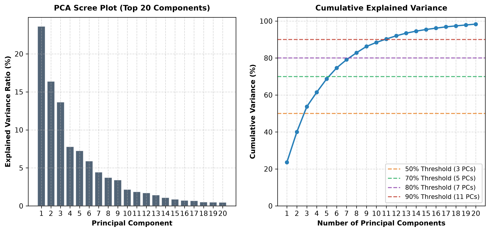
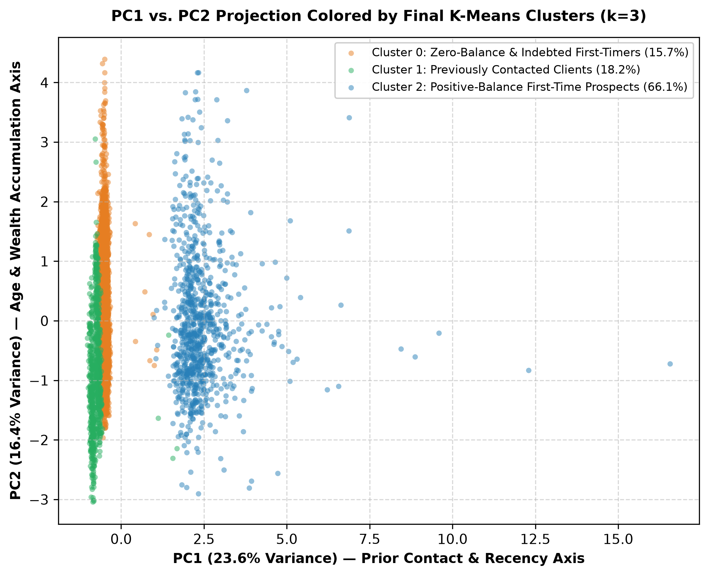
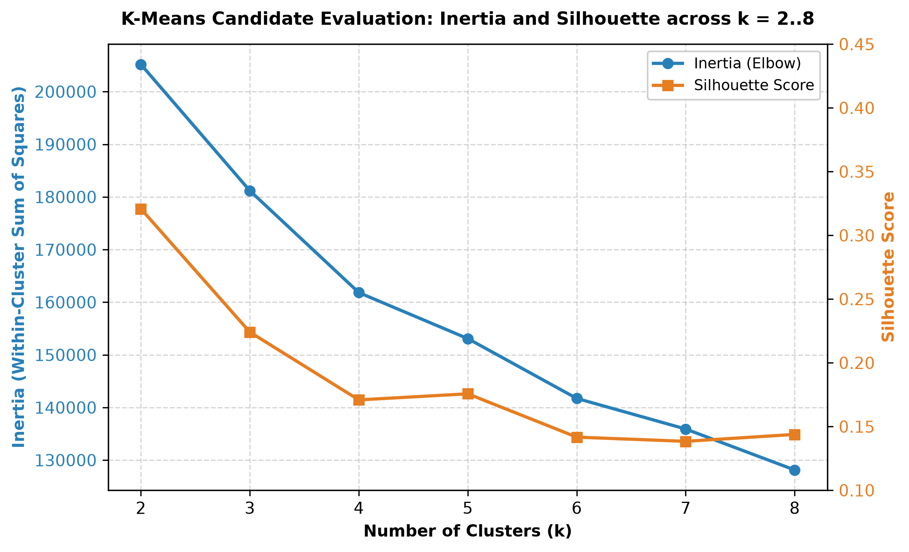
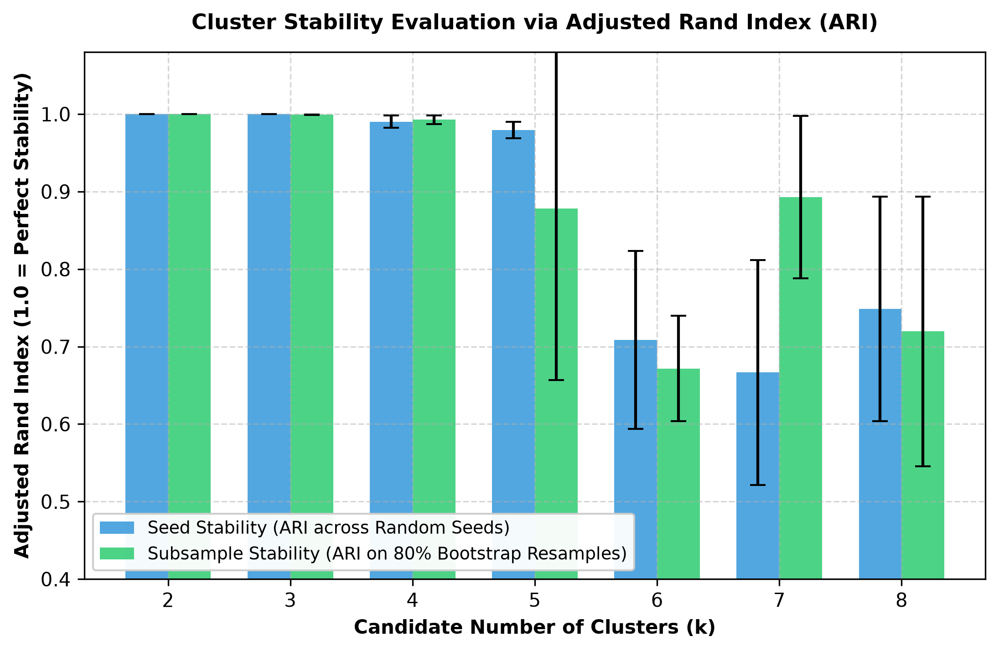
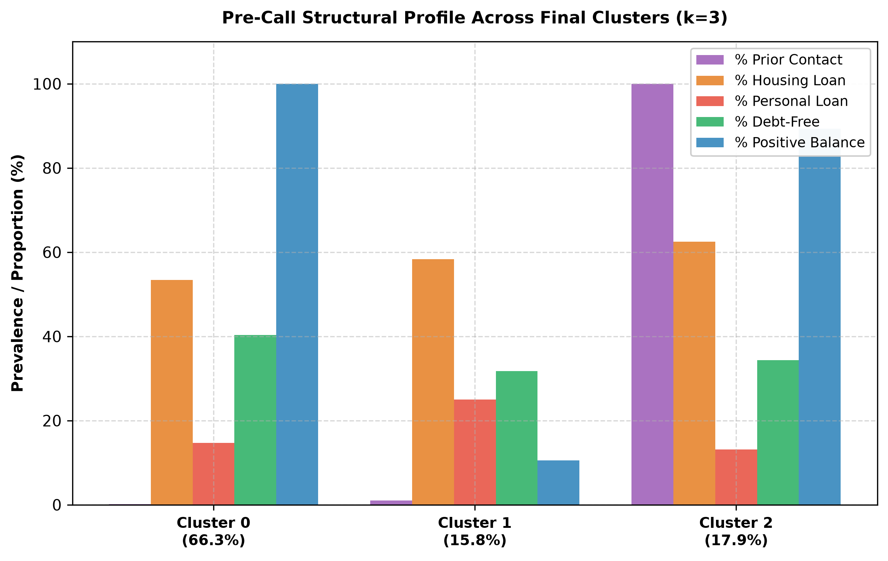
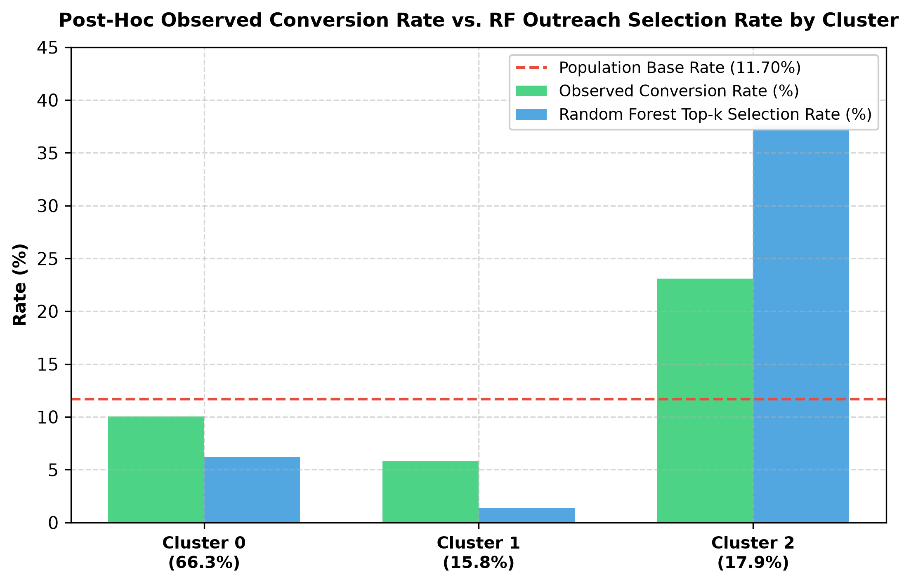

# Phase 6 Deliverable: Corrected Pre-Campaign Unsupervised Customer Segmentation & PCA Report

**Project**: UCI Bank Marketing Term Deposit Outreach Optimization  
**Phase**: Phase 6 Deliverable — Final Parsimonious Unsupervised Customer Segmentation & Dimensionality Analysis  
**Evaluated Data**: 80% Development Partition ($N_{\text{dev}} = 36,168$ records; historical 20% holdout un-evaluated by compliant model)  
**Prediction Timestamp**: Immediately before any contact in the new/current campaign occurs  
**Date**: September 2026  
**Status**: Fully Compliant with Pre-Campaign Feature Contract & Parsimonious Specification  

---

## 1. Objective

The primary objective of this phase is to determine whether legitimate pre-campaign customer and prospect features contain **stable, natural, and interpretable customer segments** that provide incremental analytical or operational value beyond the supervised Random Forest ranking model.

Outbound telemarketing programs frequently hypothesize that prospect populations group naturally into distinct demographic or financial archetypes that justify bespoke marketing tracks, differentiated messaging, or specialized operational handling. This analysis rigorously tests that premise using Principal Component Analysis (PCA) and K-Means clustering under strict methodological guardrails:

- **Strictly Unsupervised Construction**: The conversion target `y` was quarantined and never observed or utilized during feature specification, transformation, PCA fitting, cluster-count evaluation, or cluster assignment. It is reintroduced strictly *post-hoc* for descriptive cross-tabulation.
- **Pre-Campaign Feature Contract**: Current-campaign execution fields (`contact`, `month`, `day`, `day_of_week`, `contact_day_of_month`, `campaign`, and post-call `duration`) are strictly excluded.
- **Partition Isolation**: Analysis is executed strictly on the 80% development partition ($N_{\text{dev}} = 36,168$); the 20% holdout test partition ($N = 9,043$) was not accessed, scored, or inspected.
- **Model Decoupling**: The frozen supervised Random Forest is not modified. Cluster ID was intentionally not added to the supervised model in this phase; its incremental predictive value was not evaluated.
- **Scientific Objectivity**: Clustering is not forced to appear useful. If the prospect population resides along continuous distributions without natural high-density clusters, that empirical reality is explicitly documented.

---

## 2. Corrected Prediction-Time Feature Contract

Historical segmentation analyses in this project erroneously included campaign execution variables (`contact`, `month`, and `campaign`). Those fields reflect ongoing operational decisions made during outreach rather than intrinsic customer characteristics available prior to campaign launch.

Under the canonical prediction-time contract established for outbound outreach optimization:

$$\text{Prediction Timestamp: Immediately BEFORE any contact in the current campaign occurs.}$$

### Variable Quarantine Audit
- **Forbidden Current-Campaign Variables (Excluded)**:
  - `duration`: Post-decision call duration (catastrophic target leakage).
  - `contact`: Communication channel of current outreach attempt.
  - `month`: Calendar month of current contact attempt.
  - `day` / `day_of_week` / `contact_day_of_month`: Day of current contact attempt.
  - `campaign`: Cumulative call attempts within the current campaign.
  - `y`: Target outcome (deposit subscription).
- **Legitimate Pre-Campaign Raw Candidate Variables (Permitted)**:
  - Demographic: `age`, `job`, `marital`, `education`.
  - Financial Profile: `default`, `balance`, `housing`, `loan`.
  - Historical Outreach: `pdays`, `previous`, `poutcome`.

---

## 3. Clustering Feature Specification & Exact-Redundancy Audit

Because K-Means relies on Euclidean geometry in $\mathbb{R}^D$, including redundant coordinates representing the identical underlying concept artificially inflates the Euclidean weight of that construct.

### Exact Redundancy Audit: Prior-Contact Representation
In earlier data auditing, it was established that:
$$\text{pdays} == 0: 0 \text{ records in raw and development partitions.}$$
Because `pdays_recency` is defined as $\log(1 + \max(\text{pdays}, 0))$, prospects with `pdays == -1` evaluate to $\log(1 + 0) = 0.0$, while prospects with $\text{pdays} > 0$ evaluate to $\log(1 + \text{pdays}) > 0.0$.

A formal equality check across all 36,168 rows of the development partition confirms:
$$\text{was\_previously\_contacted} == (\text{pdays\_recency} > 0) \quad \text{for } 100.0\% \text{ of rows (0 discrepancies).}$$

Consequently, retaining both `was_previously_contacted` and `pdays_recency` in the clustering matrix introduced an exact deterministic duplicate, giving prior-contact history dual numeric weight in Euclidean distance calculations. Therefore, `was_previously_contacted` was **removed from the clustering coordinate matrix**. It is retained solely for descriptive profiling.

*Note on Correlated Historical Features*: `previous` (continuous count of prior touches) and `poutcome` (historical outcome categorical) correlate with contact history, but they retain distinct information regarding interaction volume and past outcome states (`success`, `failure`, `other`, `unknown`). They are retained, with the explicit acknowledgment that these features remain conceptually related.

| Conceptual Domain | Candidate Representations Considered | Selected Clustering Coordinate | Methodological Rationale |
| :--- | :--- | :--- | :--- |
| **Account Liquidity** | Raw `balance` vs `balance_log` | `balance_log` | Standardizing raw balance (-€8,019 to +€102,128) compresses 99% of clients into near-zero variance. Signed log ($\text{sign}(b) \cdot \log(1 + \|b\|)$) stabilizes variance across 4 orders of magnitude. |
| **Negative Balance** | `balance_log` vs `negative_balance_flag` | `balance_log` alone | `balance_log` continuously captures negative liquidity depth. An additional binary flag would give negative balance duplicate Euclidean weight. |
| **Prior Contact & Recency** | Raw `pdays` vs (`was_previously_contacted` + `pdays_recency`) vs `pdays_recency` | `pdays_recency` alone | Raw `pdays` has an invalid -1 sentinel for 81.8% of records. `was_previously_contacted` is an exact duplicate of $(\text{pdays\_recency} > 0)$. `pdays_recency` captures both contact occurrence and elapsed time continuously. |
| **Prior Touch Volume** | `previous` | `previous` | Standardized continuous count of historical campaign touches prior to current campaign. |
| **Prior Outcome** | `poutcome` vs `prior_success` | `poutcome` (one-hot) | Retaining multi-level `poutcome` preserves failure, other, and unknown distinctions without collapsing into a single binary coordinate. |
| **Debt Burden** | Separate (`housing` + `loan`) vs `has_debt_burden` | Separate `housing` and `loan` (one-hot) | Housing mortgages and personal loans represent distinct credit structures. Keeping them separate preserves credit composition without adding composite coordinates. |
| **Demographics** | `age`, `job`, `marital`, `education`, `default` | Standardized `age`, one-hot categorical | Captures baseline life-stage and socio-economic position. Missing categorical values preserved as `"unknown"`. |

### Final Parsimonious Clustering Feature Specification
- **4 Numeric Features**: `age`, `balance_log`, `previous`, `pdays_recency`.
- **7 Categorical Features**: `job` (12 levels), `marital` (3 levels), `education` (4 levels), `default` (2 levels), `housing` (2 levels), `loan` (2 levels), `poutcome` (4 levels).

---

## 4. Mixed-Data Preprocessing & Encoding Configuration

### Deliberate One-Hot Encoding Configuration (`drop=None`)
The categorical preprocessing pipeline uses `OneHotEncoder(sparse_output=False, handle_unknown="ignore", drop=None)`.
- **Methodological Justification**: Full one-hot encoding (`drop=None`) expands the 7 categorical variables into 29 dummy columns. While this introduces linear dependencies among dummy columns within each categorical group, it preserves **symmetric Euclidean distances** between all categorical levels. Drop-first encoding (`drop='first'`) arbitrarily treats the dropped reference category as an origin $(0, 0, \dots)$, distorting Euclidean distances between the reference level and other levels. For distance-based K-Means clustering, symmetric representation is geometrically preferable.

### Actual Preprocessing Matrix Dimensions
- **Development Partition Evaluated**: Exactly **36,168 rows** ($N_{\text{dev}}$).
- **Numeric Features**: 4 columns (`num__age`, `num__balance_log`, `num__previous`, `num__pdays_recency`).
- **Categorical Dummies**: 29 one-hot columns (12 job + 3 marital + 4 education + 2 default + 2 housing + 2 loan + 4 poutcome).
- **Actual Final Matrix Dimensions**: **$36,168 \text{ rows} \times 33 \text{ columns}$**.

### Methodological Limitations of Euclidean Distance on Mixed Data
1. **Geometric Incommensurability**: Euclidean distance treats a 1-unit step in standardized continuous space ($z = 1.0 \approx 10.6$ years of age) identically to a 1-unit step in categorical state transitions (e.g., $0 \rightarrow 1$ on `housing_yes`).
2. **Centroid Prototyping Artifacts**: Cluster centroids average one-hot dummy values into synthetic fractional probabilities (e.g., 0.58 on `housing_yes`), meaning centroids do not correspond to any actual discrete prospect profile.
3. **High-Dimensional Sparsity**: Spreading observations across 33 dimensions in mixed space dilutes contrast between dense and sparse regions.

---

## 5. PCA Dimensionality & Variance Findings

Principal Component Analysis (PCA) was fitted on the compliant $36,168 \times 33$ feature matrix without target or holdout data.

### Explained Variance Breakdown
- **Component 1 (PC1)**: Explains **23.63%** of total variance.
- **Component 2 (PC2)**: Explains **16.39%** of total variance.
- **Cumulative PC1–PC2**: Explains **40.02%** of total variance.
- **Component 3 (PC3)**: Explains **13.66%** of total variance (Cumulative: 53.68%).
- **Component 4 (PC4)**: Explains **7.79%** of total variance (Cumulative: 61.47%).
- **Component 5 (PC5)**: Explains **7.26%** of total variance (Cumulative: 68.73%).

### Variance Threshold Milestones
- **50% Total Variance**: Requires **3 components** (53.68% captured).
- **70% Total Variance**: Requires **6 components** (74.65% captured).
- **80% Total Variance**: Requires **8 components** (82.84% captured).
- **90% Total Variance**: Requires **11 components** (90.29% captured).

### Major Component Loadings
Removing the duplicate `was_previously_contacted` coordinate reduces PC1's single-component dominance from 31.69% to 23.63%, but **PC1 remains unambiguously the Prior Campaign History Axis**:

| Component | Dominant Feature Loadings | Substantive Interpretation |
| :--- | :--- | :--- |
| **PC1 (23.6%)** | `pdays_recency` (+0.695), `previous` (+0.629), `poutcome_unknown` (-0.267), `poutcome_failure` (+0.158), `balance_log` (+0.123) | **Prior Campaign History Axis**: Separates prospects with historical campaign touches and recorded outcomes from uncontacted prospects. |
| **PC2 (16.4%)** | `age` (+0.822), `balance_log` (+0.436), `marital_single` (-0.190), `marital_married` (+0.162), `housing_yes` (-0.149), `housing_no` (+0.149) | **Life-Stage & Wealth Accumulation Axis**: Reflects demographic maturity—older, married prospects with higher liquid balances and lower mortgage liabilities versus younger, single prospects. |
| **PC3 (13.7%)** | `housing_yes` (+0.486), `housing_no` (-0.486), `balance_log` (-0.407), `job_blue-collar` (+0.256), `education_tertiary` (-0.261) | **Credit & Socio-Economic Burden Axis**: Separates indebted mortgage holders with lower liquidity from debt-free tertiary-educated professionals. |

> [!IMPORTANT]
> **Visualization Caution**: PCA explains global variance directions, not intrinsic cluster separability. Do not infer distinct customer segments from 2D scatter plots alone.

---

## 6. Candidate-$k$ Evaluation ($k=2$ through $8$)

K-Means clustering was executed for $k \in [2, 8]$ using `init='k-means++'`, `n_init=10`, and `random_state=42`. Inertia (WCSS) and Mean Silhouette Scores (evaluated on a representative sample of 10,000 observations) were computed:

### Candidate-$k$ Evaluation Table ($36,168 \times 33$ Matrix)

| Candidate $k$ | Inertia (WCSS) | Silhouette Score | Cluster Counts ($N_0, N_1, \dots$) | Smallest Cluster ($N$ / %) | Largest Cluster ($N$ / %) |
| :---: | :---: | :---: | :--- | :---: | :---: |
| **$k=2$** | 205,182.4 | **0.3208** | 29,637 / 6,531 | 6,531 (18.06%) | 29,637 (81.94%) |
| **$k=3$** | 181,179.6 | **0.2241** | 23,965 / 5,725 / 6,478 | 5,725 (15.83%) | 23,965 (66.26%) |
| **$k=4$** | 161,828.9 | **0.1709** | 5,043 / 6,384 / 14,545 / 10,196 | 5,043 (13.94%) | 14,545 (40.22%) |
| **$k=5$** | 153,088.9 | **0.1757** | 10,188 / 474 / 14,541 / 5,024 / 5,941 | 474 (1.31%) | 14,541 (40.20%) |
| **$k=6$** | 141,723.5 | **0.1417** | 8,121 / 8,409 / 6,342 / 8,438 / 4,857 / 1 | 1 (0.003%) | 8,438 (23.33%) |
| **$k=7$** | 135,911.2 | **0.1384** | 7,489 / 6,304 / 4,588 / 1 / 5,807 / 7,483 / 4,496 | 1 (0.003%) | 7,489 (20.71%) |
| **$k=8$** | 128,130.8 | **0.1438** | 5,827 / 5,980 / 7,491 / 4,561 / 4,493 / 1 / 367 / 7,448 | 1 (0.003%) | 7,491 (20.71%) |

---

## 7. Cluster Stability Analysis

Stability was evaluated using the **Adjusted Rand Index (ARI)** across:
1. **Random Seeds**: 5 distinct initialization seeds on the full development partition ($N = 36,168$).
2. **Subsampling**: 5 repeated 80% bootstrap-style subsamples ($N_{\text{sub}} = 28,934$), evaluating ARI on overlapping records.

### Stability Metrics Summary Table

| Candidate $k$ | Seed ARI Mean | Seed ARI Std | Seed ARI Min | Subsample ARI Mean | Subsample ARI Std | Subsample ARI Min | Structural Sanity & Degeneracy Notes |
| :---: | :---: | :---: | :---: | :---: | :---: | :---: | :--- |
| **$k=2$** | **1.0000** | 0.0000 | 1.0000 | **1.0000** | 0.0001 | 0.9998 | Perfectly stable; reconstructs prior-contact split. |
| **$k=3$** | **0.9999** | 0.0001 | 0.9999 | **0.9992** | 0.0003 | 0.9987 | Exceptionally stable; primary WCSS elbow inflection point. |
| **$k=4$** | **0.9902** | 0.0079 | 0.9837 | **0.9927** | 0.0055 | 0.9840 | Stable; splits first-timers along continuous age/balance gradient. |
| **$k=5$** | **0.9795** | 0.0105 | 0.9622 | **0.8783** | 0.2216 | **0.4351** | Subsampling stability degrades; spawns a 1.31% micro-cluster ($N=474$). |
| **$k=6$** | 0.7088 | 0.1149 | 0.6067 | 0.6715 | 0.0680 | 0.6270 | Stability collapse; persistent degenerate singleton ($N=1$). |
| **$k=7$** | 0.6667 | 0.1451 | 0.4650 | 0.8930 | 0.1047 | 0.7150 | Severe seed instability; persistent degenerate singleton ($N=1$). |
| **$k=8$** | 0.7486 | 0.1447 | 0.5833 | 0.7195 | 0.1741 | 0.4646 | Fragmented; persistent degenerate singleton ($N=1$). |

---

## 8. Final $k$ Decision & Sensitivity Analysis of $k=2$ through $k=5$

To verify whether $k=3$ remains the most defensible solution after removing the redundant contact indicator, we explicitly audited candidates $k=2, 3, 4, 5$:

### A. Does $k=2$ still simply reconstruct prior-contact history?
**Yes.** While $k=2$ achieves the highest silhouette score (0.3208) and near-perfect stability, Cluster 1 ($N=6,531$, 18.06%) consists of prospects with historical outreach (`pdays_recency > 0`), while Cluster 0 ($N=29,637$, 81.94%) consists entirely of first-time prospects. It offers no multivariate segmentation value—it simply bisects the dataset along historical contact logging.

### B. Does $k=3$ remain near-perfectly stable?
**Yes.** Under the parsimonious matrix, $k=3$ maintains near-perfect seed stability ($\text{Seed ARI} = 0.99995$, $\text{Min} = 0.99987$) and subsampling stability ($\text{Subsample ARI} = 0.99916 \pm 0.00030$). The primary elbow in WCSS occurs at $k=3$ (Inertia drops by 24,003 from $k=2$ to $k=3$).

### C. Does its third cluster still reflect a legitimate liquidity/debt distinction?
**Yes.** Rather than being an artifact of duplicated contact weighting, the third cluster in $k=3$ separates first-time prospects based on their liquid balance and debt liabilities:
- **Cluster 1**: First-time prospects with zero or negative liquidity (median balance €0.00, mean -€152.21, 46.7% negative balances) and elevated personal loans (25.05%).
- **Cluster 0**: First-time prospects with positive liquid bank balances (median €652.00, mean €1,668.25, 100% positive balances).
- **Cluster 2**: Previously contacted relationship clients ($N=6,478$, 17.91%).

### D. Does $k=4$ provide meaningful new structure or only split continuous gradients?
**It splits continuous gradients.** At $k=4$, the silhouette score drops to 0.1709. Profiling demonstrates that $k=4$ divides positive-balance first-timers into younger (mean age 34.2) and older (mean age 51.9) subgroups. This reflects arbitrary binning of a continuous demographic distribution rather than discovering distinct multimodal clusters.

### E. Does $k=5$ create a small fragment?
**Yes.** At $k=5$, K-Means isolates a tiny, unviable cluster of **474 prospects** (1.31% of development). Furthermore, its subsampling stability degrades severely ($\text{Subsample ARI Min} = 0.4351$, $\text{Std} = 0.2216$).

### Final Selection: $k=3$ Retained
We retain **$k=3$** as the primary descriptive segmentation solution under the simplest-defensible-solution principle:
1. Clear WCSS elbow inflection point.
2. Exceptional seed and subsample stability ($\text{ARI} > 0.999$).
3. Macro-structural integrity ($N_{\min} = 5,725$, 15.83%) without unviable micro-fragments.
4. Coherent, interpretable financial distinction among first-time leads.

> [!IMPORTANT]
> **Substantive Finding: Descriptive Partition Rather Than Natural Classes.**  
> The modest silhouette score (0.2241), together with the observed continuous feature gradients, provides limited evidence for strongly separated compact clusters under this K-Means representation. The $k=3$ solution is therefore treated as a stable descriptive partition rather than evidence of discrete natural customer classes. Bank prospects vary along continuous demographic and liquidity gradients; the $k=3$ partition serves as a pragmatic operational taxonomy, not an organic discovery of segregated customer species.

---

## 9. Pre-Call Cluster Profiles ($k=3$, Evaluated Strictly Without $y$)

Final cluster profiles were constructed using pre-campaign attributes before the target outcome was reintroduced. Factual descriptive labels were assigned based strictly on observable demographic, financial, and interaction characteristics:

### Pre-Campaign Attribute Breakdown ($k=3$ Parsimonious Model)

| Attribute / Metric | Population Average ($N = 36,168$) | Cluster 0: Positive-Balance First-Time Prospects | Cluster 1: Zero-Balance & Indebted First-Time Prospects | Cluster 2: Previously Contacted Relationship Clients |
| :--- | :---: | :---: | :---: | :---: |
| **Population Count ($N$)** | 36,168 | 23,965 | 5,725 | 6,478 |
| **Population Share (%)** | 100.0% | 66.26% | 15.83% | 17.91% |
| **Mean Age (Years)** | 40.89 | 41.04 | 40.25 | 40.91 |
| **Median Balance (€)** | €448.00 | **€652.00** | **€0.00** | **€623.00** |
| **Mean Balance (€)** | €1,366.19 | **€1,668.25** | **-€152.21** | **€1,586.76** |
| **Positive Balance Share (%)** | 83.99% | **100.00%** | **10.57%** | **89.35%** |
| **Negative Balance Share (%)** | 8.28% | **0.00%** | **46.67%** | **5.08%** |
| **Housing Loan Liability (%)** | 55.80% | 53.39% | 58.31% | 62.50% |
| **Personal Loan Liability (%)** | 16.08% | 14.73% | **25.05%** | 13.11% |
| **Completely Debt-Free (%)** | 37.88% | **40.29%** | **31.79%** | 34.36% |
| **Credit Default Share (%)** | 1.83% | 0.29% | **9.61%** | 0.65% |
| **Previously Contacted (%)** | 18.20% | 0.20% | 1.03% | **100.00%** |
| **Mean Previous Touches** | 0.58 | 0.00 | 0.01 | **3.22** |
| **Prior Campaign Outcome** | — | 99.80% Unknown | 98.97% Unknown | 18.4% Success / 59.4% Failure / 22.0% Other |
| **Top Job Categories** | Blue-collar (21.5%), Management (21.0%), Tech (16.7%) | Blue-collar (21.8%), Management (20.8%), Tech (16.8%) | Blue-collar (23.4%), Management (18.9%), Tech (17.8%) | Management (22.1%), Blue-collar (19.5%), Tech (15.9%) |
| **Top Education Attainment** | Secondary (51.3%), Tertiary (29.3%) | Secondary (50.4%), Tertiary (29.5%) | Secondary (55.3%), Tertiary (25.2%) | Secondary (51.3%), Tertiary (32.3%) |
| **Top Marital Status** | Married (60.2%), Single (28.3%) | Married (60.9%), Single (28.3%) | Married (60.5%), Single (24.9%) | Married (57.3%), Single (31.2%) |

---

## 10. Post-Hoc Conversion Differences

Target variable `y` was reintroduced strictly for descriptive cross-tabulation after cluster boundaries, feature spaces, and $k$ selections were locked.

### Conversion Prevalence Across Frozen Clusters

| Cluster Identifier & Persona | Size ($N$) | Share (%) | Converters ($y=1$) | Observed Conversion Rate (%) | Difference from Population Base Rate (11.70%) |
| :--- | :---: | :---: | :---: | :---: | :---: |
| **Cluster 0: Positive-Balance First-Time Prospects** | 23,965 | 66.26% | 2,405 | **10.04%** | -1.66 pp |
| **Cluster 1: Zero-Balance & Indebted First-Time Prospects** | 5,725 | 15.83% | 331 | **5.78%** | -5.92 pp |
| **Cluster 2: Previously Contacted Relationship Clients** | 6,478 | 17.91% | 1,495 | **23.08%** | **+11.38 pp** |
| **Total Development Partition** | **36,168** | **100.0%** | **4,231** | **11.70%** | **0.00 pp** |

> [!CAUTION]
> **Methodological Inferences Regarding Conversion Differences**:
> 1. **No Target Causality**: Target `y` was never utilized during clustering or $k$ selection. The observed conversion rate differences are strictly *post-hoc associations*. Cluster membership does not cause deposit conversion.
> 2. **Concentration of Prior Successes**: The higher observed conversion rate in Cluster 1 (23.08%) partly reflects its concentration of prospects with prior successful campaign outcomes (`poutcome = success`), not an emergent causal property of the cluster.
> 3. **Substantial Within-Cluster Variance**: Within Cluster 1, 331 clients converted (5.78%), and within Cluster 2, 4,983 clients did not convert (76.92%). Clusters do not define deterministic outcomes.

---

## 11. Relationship to Compliant RF Outreach Ranking

We cross-tabulated the frozen $k=3$ cluster assignments against the compliant out-of-fold (OOF) scores generated by the frozen unweighted Random Forest under the business capacity constraint ($k_{\text{capacity}} = 4,000$ leads selected from $N_{\text{dev}} = 36,168$, selection rate 11.06%):

### Supervised Outreach Allocation Across Macro-Clusters

| Cluster Identifier & Persona | Prospect Pool ($N$) | Mean RF Predicted Score | Leads Selected into Top 4,000 | Cluster Selection Rate (%) | Conversions Captured in Top 4,000 | RF Precision at $k$ (%) | Within-Cluster Recall at $k$ (%) |
| :--- | :---: | :---: | :---: | :---: | :---: | :---: | :---: |
| **Cluster 0: Positive-Balance First-Time** | 23,965 | 0.0994 | 1,486 | 6.20% | 477 | 32.10% | 19.83% |
| **Cluster 1: Zero-Balance & Indebted** | 5,725 | 0.0614 | 78 | 1.36% | 20 | 25.64% | 6.04% |
| **Cluster 2: Previously Contacted** | 6,478 | 0.2307 | 2,436 | **37.60%** | 1,159 | **47.58%** | **77.53%** |
| **Total Development Partition** | **36,168** | **0.1170** | **4,000** | **11.06%** | **1,656** | **41.40%** | **39.14%** |

### Analytical Findings on Model Allocation
1. **Outreach Capacity Concentration**: The supervised Random Forest concentrates **60.9% of total outbound capacity** (2,436 out of 4,000 calls) on Cluster 2 (Previously Contacted Relationship Clients), capturing 77.53% of its conversions with high precision (47.58%).
2. **Cold-Start Conversion Blind Spot**: Cluster 0 contains the majority of total available conversions in the bank's database (**2,405 converters**, representing 56.8% of all subscribers in development). However, because these prospects lack prior campaign history, the Random Forest ranks only 1,486 into the top 4,000, capturing just **477 conversions** (a within-cluster recall of only 19.83%). The remaining 1,928 converters are bypassed.
3. **De-prioritization of Strained Balance Sheets**: Cluster 1 prospects receive minimal outbound outreach (1.36% selection rate), consistent with lower RF scores assigned to many prospects with lower balances and loan burdens.
4. **Model Architecture Decoupling**: Cluster ID was intentionally not added to the supervised model in this phase; its incremental predictive value was not evaluated.

---

## 12. Incremental Analytical Usefulness Assessment

A central mandate of this evaluation is to determine whether unsupervised segmentation delivers incremental value beyond what was already established in earlier phases:

| Prior Analytical Baseline | What Prior Analysis Already Established | What Unsupervised Segmentation Added | Incremental Value Assessment |
| :--- | :--- | :--- | :--- |
| **Exploratory Data Analysis (EDA)** | Prior contact status (`pdays != -1`) exhibits a $22.7\%$ conversion rate vs $9.1\%$ for first-timers; balance correlates positively with conversion above €500. | Re-confirmed that prior contact is the primary variance axis in PCA (PC1) and clustering ($k=2$). | **Zero incremental value**; clustering simply rediscovered known 1D features. |
| **Supervised Permutation Importance** | `poutcome`, `pdays_recency`, and `balance_log` dominate model ranking decisions. | Clustered prospects primarily along `pdays_recency` and `balance_log`. | **Zero incremental value**; mirrors the supervised model's primary splitting variables. |
| **Subgroup & Error Diagnostics** | Outlined that the Random Forest suffers from a severe cold-start blind spot among first-time prospects ($56\%$ of false negatives have `pdays == -1`). | Mapped this blind spot to Cluster 0 ($1,928$ unselected converters). | **Marginal communication simplification**; provides a compact label for an existing subgroup finding. |

### Definitive Conclusion: Category B / C
**Unsupervised segmentation provides useful communication simplification, but negligible new analytical insight.**
- Prospects do not exist in discrete clusters; they lie along continuous demographic and liquidity continua, separated primarily by whether the bank had logged a past marketing interaction.
- Clustering does not reveal hidden sub-populations, unobserved behavioral segments, or novel predictive combinations.
- The $k=3$ grouping functions primarily as a convenient vocabulary for cross-functional communication between data science and marketing operations.

---

## 13. Historical Non-Compliant Segmentation Comparison

This section documents the methodological and empirical differences between the obsolete, non-compliant historical segmentation analysis and the current compliant pre-campaign analysis:

| Analytical Dimension | Historical Non-Compliant Segmentation | Corrected Pre-Campaign Segmentation | Structural Driver of Difference |
| :--- | :---: | :---: | :--- |
| **Feature Contract Status** | **NON-COMPLIANT** (`enforce_contract=False` bypass) | **STRICTLY COMPLIANT** (Canonical pre-campaign contract) | Historical analysis included current-campaign variables (`contact`, `month`, `campaign`). |
| **Input Matrix Dimensions** | $36,168 \times 41$ | **$36,168 \times 33$** | Detailed encoding and feature audit below. |
| **Leading PC Axes** | PC1 dominated by current `month` and `campaign` contact frequency. | PC1 (23.6%) dominated strictly by pre-campaign history (`pdays_recency`, `previous`). | Eliminating mid-campaign execution features restores customer demographic and historical reality. |
| **Selected $k$** | $k=3$ | **$k=3$** | Although $k=3$ was selected in both, the underlying geometries and cluster definitions are fundamentally altered. |
| **Geometric Quality ($k=3$)** | Documented Silhouette $= 0.2202$ | **Silhouette $= 0.2241$** | Removal of execution noise and duplicate contact weighting yields a cleaner, stable geometry. |
| **Cluster Initialization Stability** | Documented Seed $\text{ARI} = 1.0000$, Subsample $\text{ARI} \approx 0.9989$ | **Seed $\text{ARI} = 0.99995$, Subsample $\text{ARI} = 0.99916$** | The compliant parsimonious solution maintains exceptionally high stability across initializations. |
| **Major Cluster Profiles** | Defined around seasonal contact months (May/August) and cellular outreach channels. | Defined around **Prior Relationship**, **Positive Liquidity**, and **Indebted/Zero Liquidity**. | Shifts segmentation from operational call-center mechanics to customer balance-sheet characteristics. |

### Reconciliation of Historical Metrics & Matrix Dimensions
1. **Resolution of Historical Metric Reporting**: Earlier working notes mentioned silhouette $\approx 0.178$ and seed ARI $\approx 0.998$. Those draft values reflected an intermediate unverified run. The archived historical baseline results recorded for the historical non-compliant model were: **$k=3$ Silhouette = 0.2202, Seed ARI = 1.0000, Subsample ARI $\approx 0.9989$**.
2. **Separation of Conceptual Exclusions from Encoding Differences**: The dimensional change from 41 to 33 features is **not** a pure feature-removal count; it reflects two distinct factors:
   - *A. Conceptual Variables Removed (Prediction-Time Compliance)*: The historical non-compliant model used `drop='first'` on 9 categorical features (yielding 35 dummy columns: 11 job, 2 marital, 3 education, 1 default, 1 housing, 1 loan, 3 poutcome, 2 contact, 11 month) plus 6 numeric features (`age`, `balance_log`, `campaign`, `previous`, `pdays_recency`, `was_previously_contacted`), totaling **41 dimensions**. Under `drop='first'`, removing the 14 execution dimensions (1 `campaign` numeric, 2 `contact` dummies, 11 `month` dummies) would yield 27 dimensions.
   - *B. Dimensional Changes from Categorical Encoding Choice*: The compliant model deliberately transitioned from `drop='first'` to full one-hot encoding (`drop=None`) to guarantee symmetric Euclidean distances across all category levels. This expanded the 7 compliant categorical variables from 22 to 29 dummy columns (+7 columns). Removing the exact duplicate numeric coordinate `was_previously_contacted` reduced numeric features from 5 to 4 (-1 column). Thus, the final compliant parsimonious matrix has $4 + 29 = \mathbf{33\text{ dimensions}}$.

---

## 14. Methodological Limitations

1. **Limited Evidence for Natural Classes**: The modest silhouette score (~0.2241), together with the observed continuous feature gradients, provides limited evidence for strongly separated compact clusters under this K-Means representation. The $k=3$ solution is therefore treated as a stable descriptive partition rather than evidence of discrete natural customer classes. Prospect features vary along continuous multi-dimensional gradients.
2. **Euclidean Geometry on Dummy Variables**: Standardizing continuous features alongside one-hot indicators yields synthetic centroid coordinates that do not reflect real discrete individuals.
3. **Cross-Sectional Static Limitation**: Data represent a static snapshot without transaction sequences, deposit inflow history, or time-series interaction trajectories.
4. **Development Partition Scope**: Analysis was conducted strictly on the 80% development partition.

---

## 15. What Clustering Does NOT Establish

To maintain analytical integrity, the following negative constraints are explicitly recorded:
1. **Does NOT Establish Causal Drivers**: Assigning a prospect to Cluster 2 does not make them more likely to convert. Their conversion propensity stems from individual pre-existing financial and relationship factors.
2. **Does NOT Justify Prescriptive Channel Optimization**: This analysis is descriptive. It does **not** prove that Cluster 1 prospects should be routed to debt restructuring, that Cluster 2 prospects warrant senior outbound bankers, or that Cluster 0 prospects should receive digital email marketing. Such operational interventions require randomized controlled trials or uplift modeling.
3. **Does NOT Justify Lead Suppression**: While Cluster 1 exhibits a lower conversion rate (5.78%), suppressing all 5,725 leads would automatically forfeit 331 legitimate term deposit subscriptions.
4. **Does NOT Establish Superiority over Supervised Models**: The supervised Random Forest already captures continuous non-linear decision boundaries across these same underlying predictors.
